This tutorial as well as other linked ones were designed to run using the following environment: [https://bluedemos.com/show/3915](https://bluedemos.com/show/3915) available also throught IBM DTE 2.0 portal [https://dte2.us1a.cirrus.ibm.com/show/3915](https://dte2.us1a.cirrus.ibm.com/show/3915)

## 環境へのアクセス
デモ環境がアサインされると、以下のような画面が確認できます
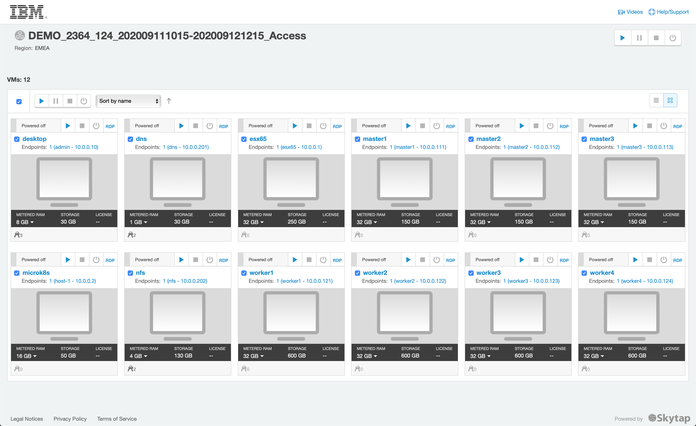

環境が停止している場合には、左上ににある Play ボタンを押して環境を起動します。すべての環境が起動し、安定するまでに10-15分ほどかかります。

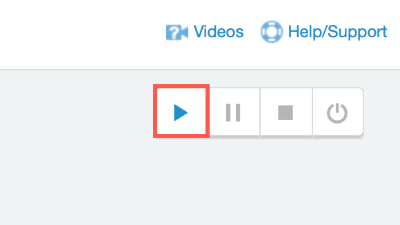

***

## デスクトップへのアクセス

  "desktop" VMのスクリーンをクリックします。
  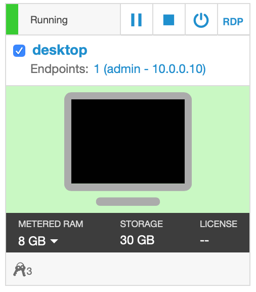
  
  以下のようなスクリーンが見えるはずです。
  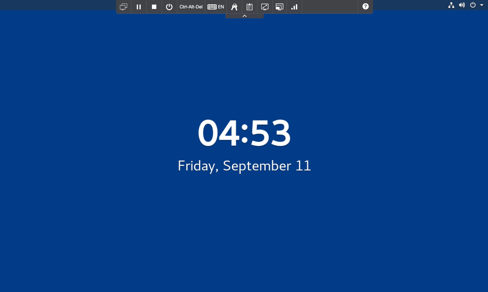
  
  スクリーン上で Enterキーを叩き、  **ibmuser** を選びます
  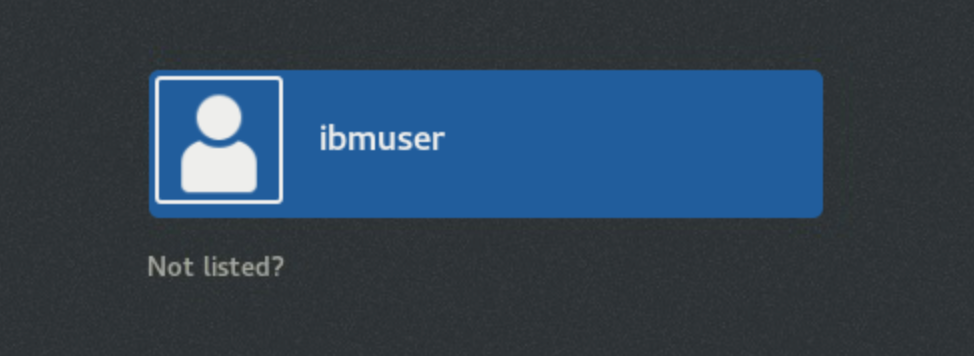

  パスワードとして **engageibm** を手で入力するか、以下の手順でパスワードをインサートします。
  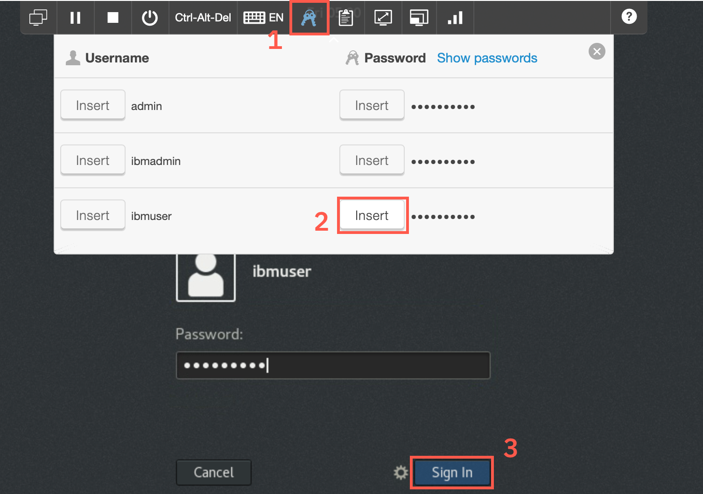

  画面のサイズは、**Fit to window** ボタンで 最大化することができます。
  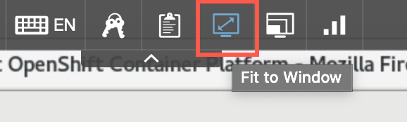

  ログインすると 自動でブラウザーが起動し、OpenShift コンソールが 起動してきます。  
  Cloud Pak for Multicloud Management は OpenShift上で稼働しています。この 管理ハブとなる OpenShift 環境にログインします。
  **htpasswd**　を選択します。
  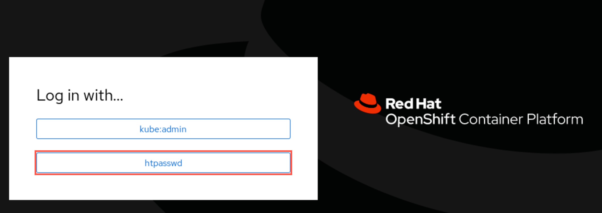

  ユーザー **ibmadmin** を選択し 保管されているパスワードでログインします。  
  環境が正しく初期化されていれば、以下のような 画面が確認できます。
  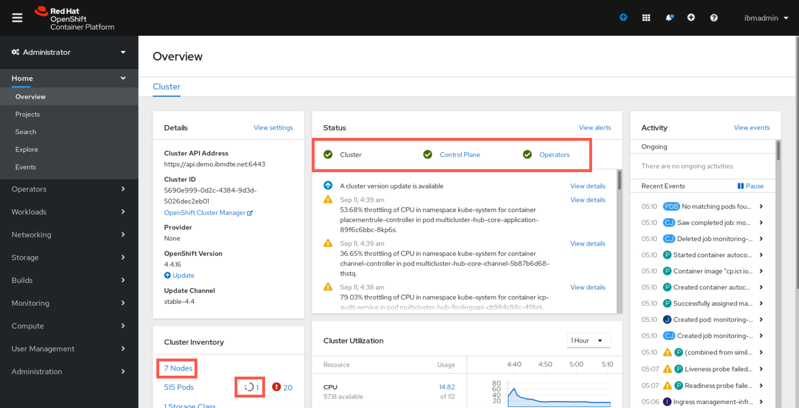

  クラスターのステータスを確認してください。 Cluster, Control Plane および Operators が 緑マークであることを確認します。  
  この演習環境は **７ノード** で構成されています。
  
  灰色アイコンの横の正常稼働していない Pod が 多数存在する場合は、セミナー講師にお声がけください。
  赤色の横の いくつかの ジョブが **エラー** となっているかもしれません。これらは 失敗した（再実行され回復した）ジョブが残っているのみで、演習には影響しません。
  

***

## Cloud Pak for MCM コンソールへのログイン

  ブラウザーの新規多分を開き、"IBM Cloud Pak for Multi..." ブックマークを開きます。
  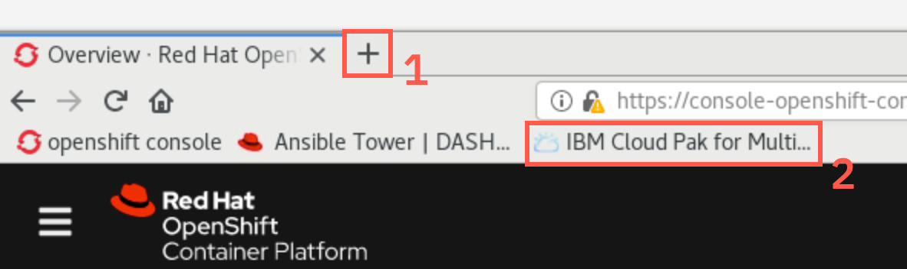

  ログイン画面で、 **Enterprise LDAP** を選び、ユーザー **bob** パスワード **Passw0rd** でログインします。
  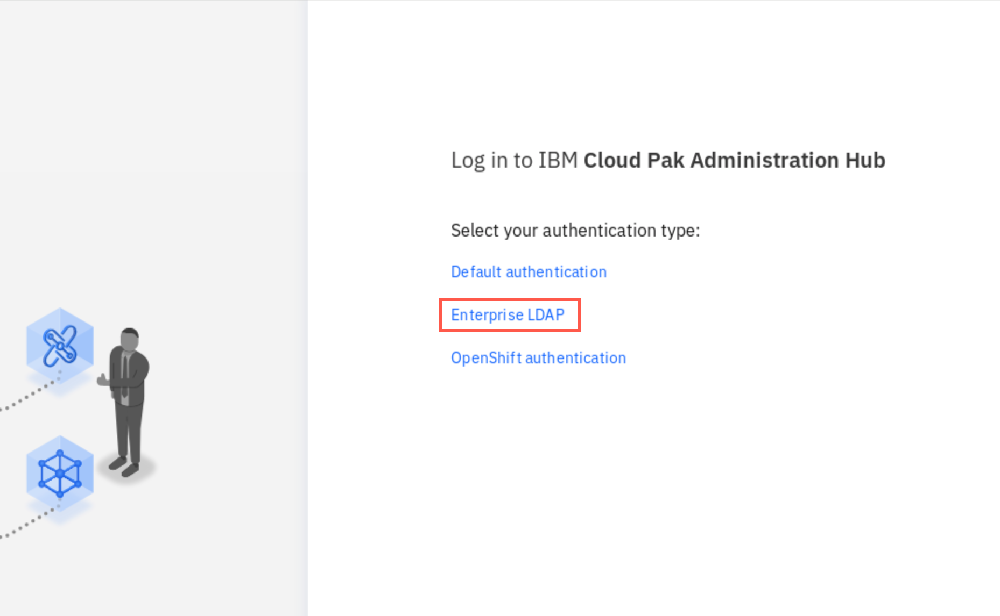
  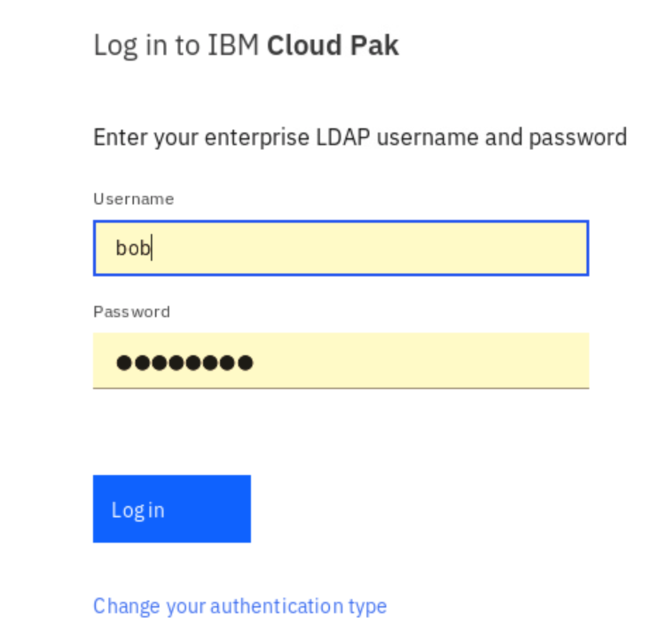

  様々な Cloud Pak を統合管理するための **IBM Cloud Pak Administration Hub** の画面が開いたら、 円グラフ横の Cloud Pak for Mutlicoloud Managment のリンクを開きます。
  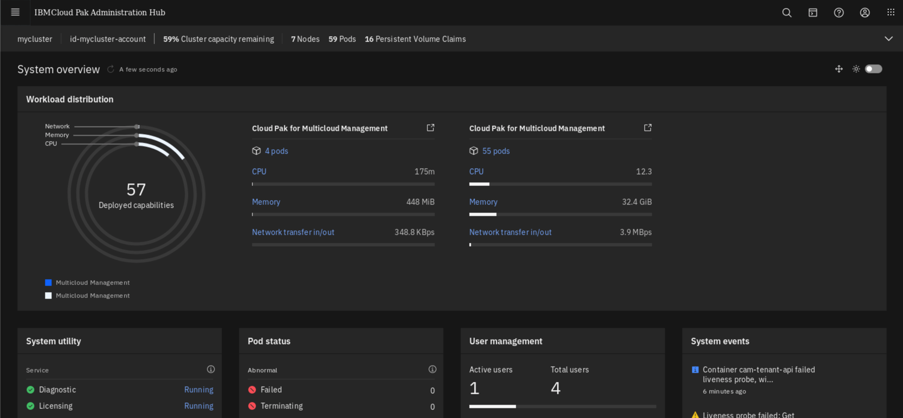

  正しく初期化されていれば、以下の画面が開きます。以下のようなメニューが見えれば、演習を開始する準備ができています。  
  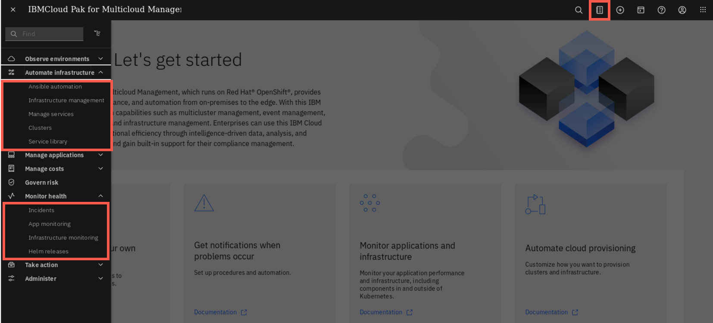

　もし正しく画面が開かない場合は、セミナー講師にお声がけください。
　
## ターミナルの確認

  ブラウザーを一旦 最小化して、デスクトップを確認します。デスクトップ上には、２つのターミナルのリンクが配置されています。
  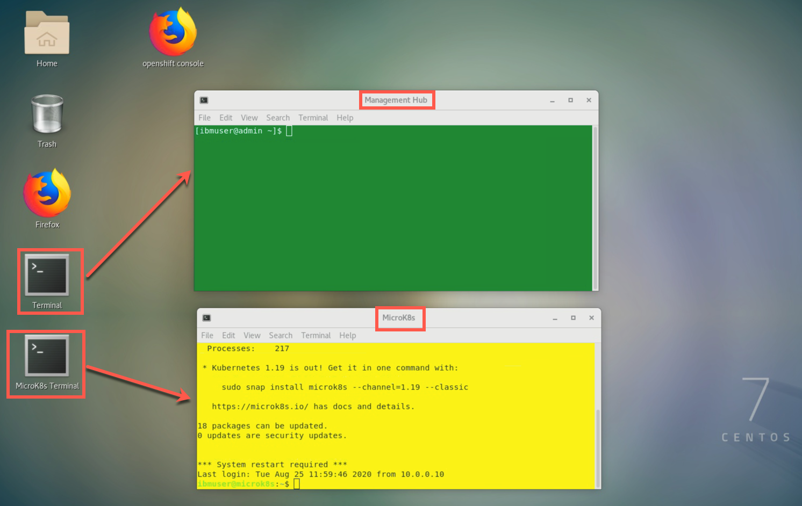

  **Termanl** と名前のついたアイコンは、 CP4MCM の **Management Hub** へのリンクです。ターミナルの背景はグリーンに設定されています。
  **Microk8s** と名前のついたアイコンは、 CP4MCM の管理対象となる **MircorK8s** 環境へのリンクです。背景は黄色に設定されています。
  
  演習の間、どちらの環境でコマンドを実行すべきかに、注意を払って下さい。

  During the excercises pay attention in which window you are supposed to run different commands
