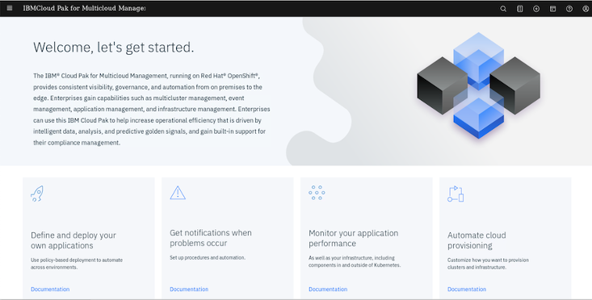
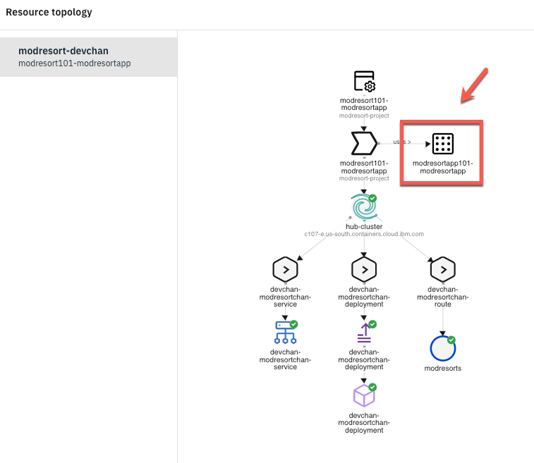

---
# Chapter 2 - アプリケーション管理

## ハンズオン概要
この章では、アプリケーション管理にまつわる以下の機能を確認していきます。
-	`アプリケケーションプレイスメント機能をもちいて、アプリケーションを払い出す`
-	`払い出したアプリケーションを PlacementRuleをもちいて、移動させる`
-	`ダッシュボードVisualize the application health using Grafana dashboards`

## Define Application Channel

IBM Cloud Pak for Multicloud Management に統合された Red Hat Advanced Cluster Management コンポーネントには、 GitOps を実現するための、アプリケーション管理機能があります。
このアプリケーション管理機能は、クラスターにまたがってアプリケーションを払いだし、管理するプロセスを、統合しシンプルにします。    
  
このアプリケーション管理機能を用いることによって、複雑となりがちなアプリケーション配置管理を、Gitのソースコード・レポジトリの変更管理と統合することが可能です。
アプリケーションの定義は、YAMLで管理されるKubernetesリソースとして、または Helmチャートにパッケージされたアプリケーションとして Gitレポジトリーに保管されています。
Red Hat Adanced Cluster Managementコンポーネントから、ソースとなる レポジトリを指定し、払い出し先を決定するために必要となる定義を指定することで、選定されたクラスターに対してアプリケーションが配置されます。
アプリケーション定義のソースはGitレポジトリにありますので、Gitに統合された開発サイクルを通じて、Gitレポジトリを修正すると、変更された内容が すでにリリースされている環境にも反映されていきます。

このアプリケーション払い出しモデルには、チャネルとサブスクリプションというモデルが使われており、継続的に自動的に Kubernetesリソースを対象となる管理クラスターに払い出します。 
チャネル (Channel.app.ibm.com) の実体は、ハブクラスター内の名前空間を定義しおり、この名前空間に デプロイメントのための各種KubernetesリソースやHelmチャートが保管されます。


ここでは、オープンソースのマイクロサービス・サンプル・アプリケーションである Bookinfoアプリケーションを、アプリケーション配置機能を使って払い出しを行います。

1. Red Hat Advanced Cluster Management コンポーネントの コンソールを開き、メニューより **Manage applications** を選択します。


1. 管理対象となっているアプリケーションはありませんので、右上の **Create application** をクリックします。


1. アプリケーションの定義画面が開きます。
  
        1. アプリケーションの名前として **modresort** を指定します　　
        1. 払出し先の名前空間を指定します。既存の名前空間から選択することもできますが、ここでは **modresort** を指定し、払出し時に名前空間を新規作成します。　　
        
        1. レポジトリー・タイプとして、ここでは **Git Repository**を選択します。選択すると、レポジトリを指定するための詳細画面が開きます。
        
        1. レポジトリ情報として、以下の情報を指定してください。
        |項目|値|
        --|--
        |URL|https://github.com/ICpTrial/ModernResort|
        |UserName|（パブリック・レポジトリですので不要です）|
        |AccessToken|（パブリック・レポジトリですので不要です）|
        |Branch|master|
        |Path|（指定不要）|
        
        |Path|（指定不要）|
        1. 配置先クラスターの指定
        配置先クラスターとして、すべての管理対象クラスターに払い出すことや、ハブ・クラスター(localcluster)のみに払い出すことが可能ですが、
        ここでは、ラベルによって条件を設定し、その条件にマッチするクラスターにアプリケーションを払い出します。　　
        **Deploy application resources only on clusters matching specified labels**にチェックを入れて、以下の値を指定します。
        |項目|値|
        --|--
        |Label|enviromemnt|
        |Value|qa|
        
        1. 内容を確認し、**Save**を保管します。Saveを押すとアプリケーションのデプロイメントが開始されます。
        
        1. デプロイしたアプリケーションのKubernetesリソースが表示されていますので確認していきます。
        

        

## Deploy the Application

In this section, you will deploy the application components to their respective Kubernetes namespaces, using the yaml files that you created in the previous task.

1.Back to the Management Hub terminal window, execute the command bellow to create two new Openshift projects.

```
oc new-project modresort-project
```

```
oc new-project modresort-entitlement
```

  

2.Now, let’s deploy the modresortchan. Execute the commands below:

```
cd ..
```

```
oc apply -f modresortchan
```

  The output of the above command will be similar to the illustration below. The output shows that Channel and Deployables are deployed.

  

3.The subscription is deployed to a different namespace than the channel. Never deploy the subscription to the same namespace as the channel. Hence, deploy the subscription to the other namespace, modresort-project.

```
oc project modresort-project
```

```
oc apply -f modresortapp
```

  

  Next section of the lab will walk you through validating the application deployment.

***

## Validate the Application

The Application view in Cloud Pak for Multicloud Management console provides graphical view into the applications, channels and subscriptions deployed in the clusters. Let’s validate if the modresort application is deployed correctly.

1.Back to the Firefox browser, you should be in your Cloud Pak for Multicloud Management Web Console.

  

2.On the top left of the page, open the **Menu** (1) and select **Manage Applications** (2) and click on **Hybrid applications** (3).

  

3.Click on the **modresort101-modresortapp** application link to get to the application Overview page.

  

4.Scroll down to view the application diagram.

  

  *Note: It may take a couple of minutes for the application to deploy to the cluster.*

  When the application is successfully deployed via the subscription, the pod in the application topology view will have a green icon as illustrated below.

  

  `Note (Only if you have issues): After a couple of minutes, if your pod has a yellow icon next to the pod, indicating it is in an unknown state, you will need to troubleshoot your yaml files for correctness and redeploy the resources.   Verify that your subscriptions are propagated correctly by running the command.`

```
oc get subscription.app.ibm.com --all-namespaces
```

  The subscription from the **modresort** should be in the **Propagated** state.

5.Back to OCP311 terminal window (blue window), let’s check the pods are in running state.

```
oc get pods -n default
```

  You should see the devchan-modresort-deployment pod running in the default namespace

  

6.Use the command line to get the devchan-modresortchan-service NodePort.

```
oc get services -n default
```

  

  Take note of the devchan-modresortchan-service nodePort (on the picture above is 30606), you will use it to access your application.

7.Back to the browser, open a new tab and navigate to:

```
http://ocp311:<NodePort>/resorts
```
  For example, http://ocp311:32664/resorts

  

  Congratulations! You have successfully deployed the modresorts application to the OpenShift 3.11 Cluster.

***

## Move the Application

Applications deployed using the Subscription model are deployed to clusters based on PlacementRules. The placement rules for deployables can be defined as a stand-alone resource and referenced by the deployable. The placement rules use cluster labels to determine where to place the applications.

In the following steps, you will move the application from the Dev cluster to the QA cluster by changing the placement policy. You also learn how to use cluster replicas.

1.Currently, the application deployed as running on Dev cluster because of the placement values specified in application, as you verified earlier.

  You can modify the placement policies from application view by selecting the placement policy and modifying the corresponding values in the yaml file. Let’s do it!

  Back to the Multicloud Management page, on the Resource topology chart, click on the **modresortapp101 placement policy** icon.

  

2.On the Editor, modify the environment setting from Dev to QA.

  

3.Apply changes by clicking on **update** icon as shown below.

  

4.Within a few minutes, the cluster value changes from ocp311 to microk8s, and the application is now running on microk8s cluster.

  

5.Let’s verify that the application is actually running on MicroK8s cluster. Go back to the yellow MicroK8s terminal windows and execute the following commands:

```
kubectl get pods -n default
kubectl get service -n default
```

  

6.Notice the **Node port** used by the service. In the example screenshot it is `30726`.

  

7.Go back to your browser window, open a new tab and provide the following URL:
  `http://microk8s:[port-number-from-previous-step]/resorts`

  

  Great, you moved the application from one cluster to the other.

8.What if you want to run the application on both the clusters? This is possible by changing clusterReplicas and matchingLabel. Let’s do it!

  Back to the Multicluster Management page, on the Editor, change **clusterReplicas** to **2**.

  

9.On the spec **matchLabels** setting, **remove** the **environment label**, and add **cloud** label with value **Other**.

  

  The label, cloud, exists on both the clusters and the value matches Other.

12.Apply the changes by clicking update icon.

  

13.Within a few minutes, the resource overview refreshes, indicating that the application is running on both clusters. You can validate by checking the status of pods on both the clusters

  

  Great, now you have your application on both clusters. Next section, you explore Grafana dashboard to visualize the application health across clusters.

  Congratulations! You have successfully completed the lab “Application Management with IBM Cloud Pak for Multicloud Management”.

***

## Summary

You completed the Cloud Pak for Multicloud Management tutorial: Multi-cluster Management. Throughout the tutorial, you explored the key takeaways:
- `Understand Cloud Pak for Multicloud Management`
-	`Define an application with Channels and Subscriptions`
-	`Deploy the application chart from the catalog`
-	`Modify Placement Policies to move application resources across clusters`
-	`Check the application health by using Federated Prometheus Dashboard`


If you would like to learn more about Cloud Pak for Multicloud Management, please refer to:
-	<a href="https://www.ibm.com/cloud/cloud-pak-for-management" target="blank">Cloud Pak for Multicloud Management home page</a>
- <a href="https://www.ibm.com/demos/collection/Cloud-Pak-for-Multicloud-Management" target="blank">Cloud Pak for Multicloud Management Demos </a>
