## Chapter1 マルチクラスター統合管理

IBM Cloud Pak for Multicloud Management は、マルチクラウド環境において、オンプレミスのVM環境からパブリッククラウドのIaaS、各種Kubernetesクラスターまで一貫した可視化と自動化およびガバナンスの基盤を提供します。

この章では、IBM Cloud Pak for Mulitcloud Management から切り出され、**open-cluster-management** としてオープンソース化された Kubernetesクラスター管理基盤 **Red Hat Advanced Cluster Management** を中心に、複数Kubernetesクラスターを統合管理する方法を確認します。

このチュートリアルでは、以下のキーとなる機能を確認します。
Cloud Pak for Multicloud Managementを のダッシュボードを理解する
- 管理対象クラスターを追加する方法を理解する
- 管理対象クラスターからの モニタリング・メトリックを収集する方法を理解する
- シンプルなアプリケーションを管理対象クラスターに払い出す

***

## ビジネス・コンテキスト

あなたは、クラウド運用チームのメンバーとして、ハイブリッド・マルチクラウド環境の管理に 問題を抱えています。  
様々な環境にまたがって展開される クラウド・ベースのサービスやデータの管理作業は毎月のように膨らんでいき、あなたのチームは押しつぶされそうです。  
あなたの会社は、オンプレミスおおびクラウド環境にたいして、複数のKubernetesクラスターを利用しています。    
いくつかのチームは可用性のために、複数クラスター、複数リージョンにまたがるアプリケーションをデプロイしています。  
また 開発やテストのためのクラスターもありますし、これらのKubernetesクラスターのアップグレードもしていく必要があります。  

管理対象となるクラスターが増えるに連れ、以下のようなチャレンジが出てきています。
- このサービスはどこで稼働しているのだろうか？
- クラスターやクラウドをまたがった、アプリケーションをどのようにモニタリングするのだろうか？
- 問題のあるコンポーネントはどこで稼働しているのだろうか？
- まるでひとつの環境であるかのように、クラスター群を管理できないだろうか？
- アプリケーションを 環境をまたがって移動させることができないか？ ポリシーベースでアプリケーションを配置できないか？
- 複数クラスター環境を、統一した基準で管理できているだろうか？ コンプライアンスの基準は満たせているだろうか？

これらの課題のなかで、あなたは IBM Cloud Pak for Multicloud Management の機能を確認しようとしています。

このチュートリアルでは、 **管理ハブクラスター** で稼働する Cloud Pak for MCM および、Cloud Pak for MCM に統合された Red Hat Advanced Cluster Management を確認していきます。  
Cloud Pak for MCM および Red Hat Advanced Cluster Management の実体も Red Hat OpenShift で稼働し、Operator により管理されるコンテナー・アプリケーションです。  
また、２つ目の **管理対象クラスター** として単一ノードで稼働するMircroK8sを利用します。
※製品の正式なサポート対象ではありませんが、リソースをおさえた環境での演習のため、便宜的に MircoK8sとして、バニラKubernetes を利用しています。  

このチュートリアルのなかでは、**管理ハブクラスター** で稼働する Cloud Pak for Multicloud Management から Red Hat Advanced Cluster Management をキックして、以下を実施します。
- 管理対象クラスターの追加
- クラスター・トポロジーの確認
- 複数クラスター環境の確認
- ちもｒ


## 管理対象クラスターの払い出し

### 新規クラスターの払い出し

このチュートリアルでは、コントロール・プレーンから新規のクラスターを払い出す手順を確認します（環境の制約上、新規のOpenShiftクラスターの払い出しは、この演習ではできません）。

### 既存クラスターのインポート

1. ブラウザーのリンクから、IBM Cloud Pak for Multicloud Management をクリックします。
2. 


***

## Overview of the managed environments

In this section, you visualize key information about your managed environments in a Cloud Pak for Multicloud Management dashboard.

1. With IBM Cloud Pak for Multicloud Management you are able to manage all your environments from a single control panel. Open the **Menu** button (1) and click **Observe environments** (2) > **Overview** (3).

  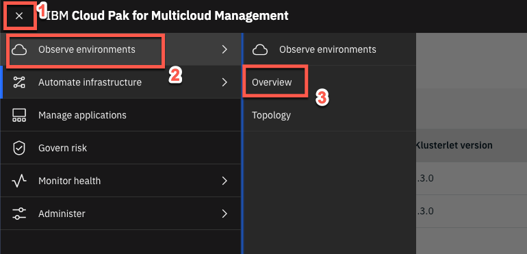

2. The Overview menu option displays the status of all clusters including the health and resource metrics. The top section shows the operations details across all your cloud providers. In the first section, you can see information about cloud providers, compute resources, applications and infrastructure. Because your both clusters are completely new, you don't have a lot of information here. But in a real production environment here is your starting point to explore your multiple clusters.

  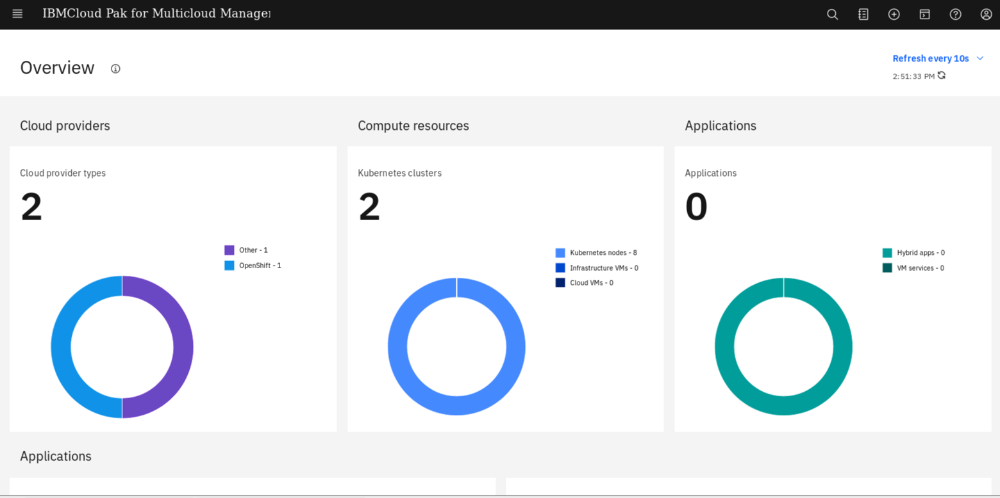

3. Scroll down to the bottom section showing Resource Overview. Here you can see Cluster Compliance status, Cluster status, CPU, Memory, and Storage Resource View.

  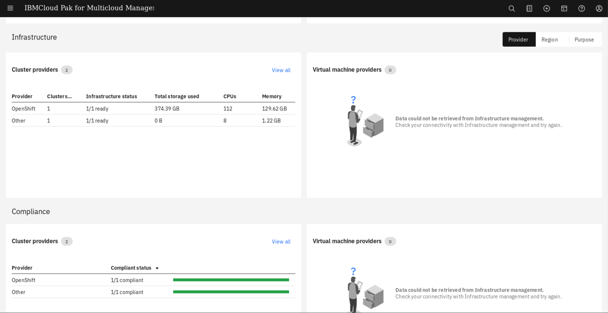

4. Now, navigate to the **Applications** page. Select "hamburger" menu in the top-left corner and then (1) **Manage applications** and (2) **Hybrid applications**.

   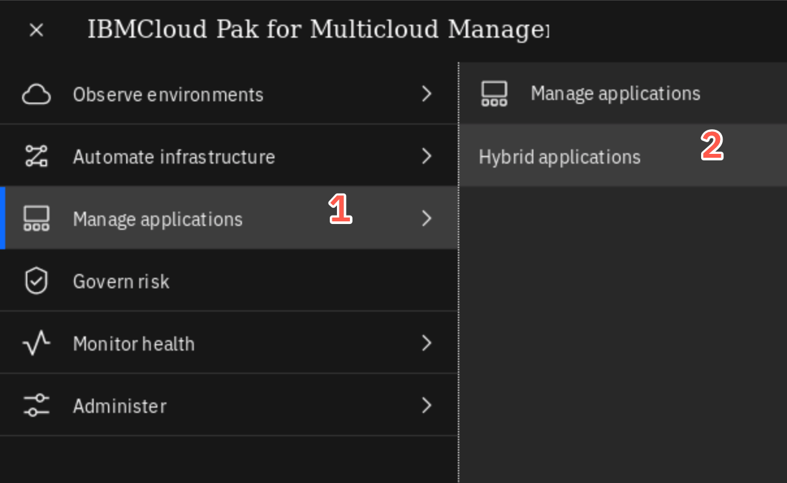

   By now, you don't have any application here. But it is important to know, that in this area, you will see information about the deployment of an application. Don’t worry about it now, you will explore it later.

5. Now, let’s explore a really good feature of Cloud Pak for Multicloud Management: Visual Web Terminal. On the top right navigator, click on **Visual Web Terminal** button.

  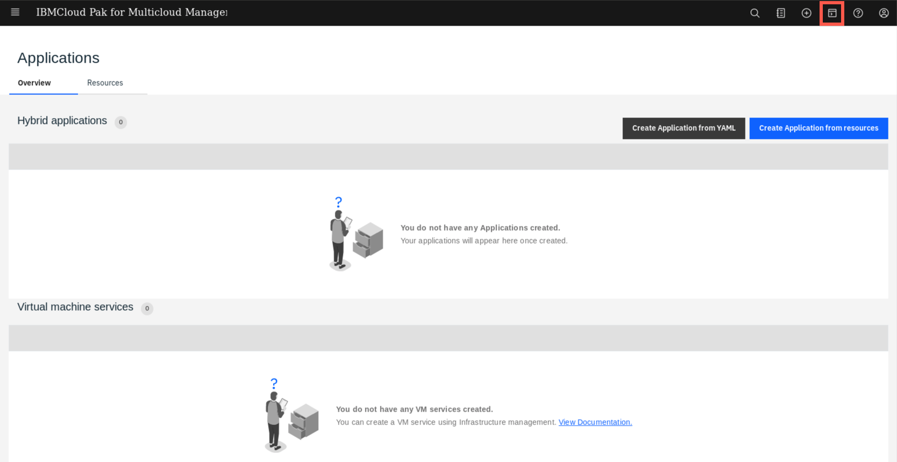

6. You can use the Visual Web Terminal to run many commands across your environment. When categorized data is returned, such as when you enter a search command, it is returned in an interactive tabular format.

  The Visual Web Terminal is particularly useful when troubleshooting issues that require running multiple commands and navigating the results of the commands in an easy way. Let’s try something simple! Enter the command bellow:

   ```
   oc project multicluster-endpoint
   ```

   ```
   oc get pods
   ```

  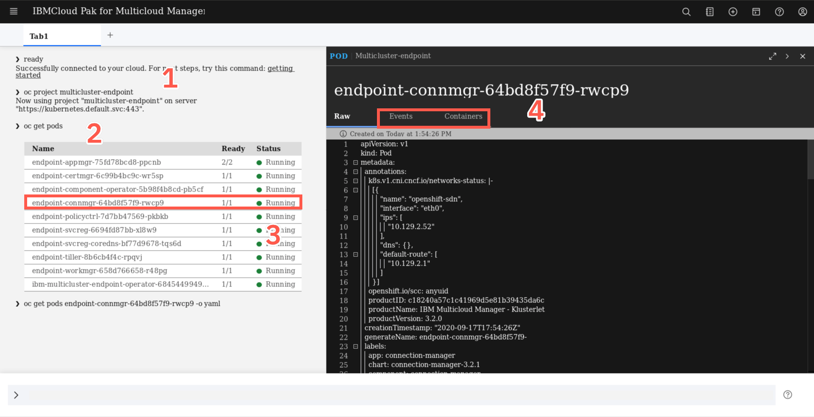

  The information that is provided in the Visual Web Terminal is limited by the permissions of the user. When you run a command, only the items that you have permission to view are displayed. You can click on any row in the displayed table (3) and then explore the details of the specific resource - for example Events (4)

  Next section, you learn how to deploy an application to the local or remote cluster.

***

## Deploy an Application

In this step, you install a helm chart from the catalog to your hub-cluster and your managed-roks cluster. Let's do it!

1. Open the **Menu** (1) and click on **Administer** (2) > **Helm repository** (3).

TO BE REPLACED!!!

2. On the Helm Repositories page, click **Add Repository** to register a new Helm Repository.

  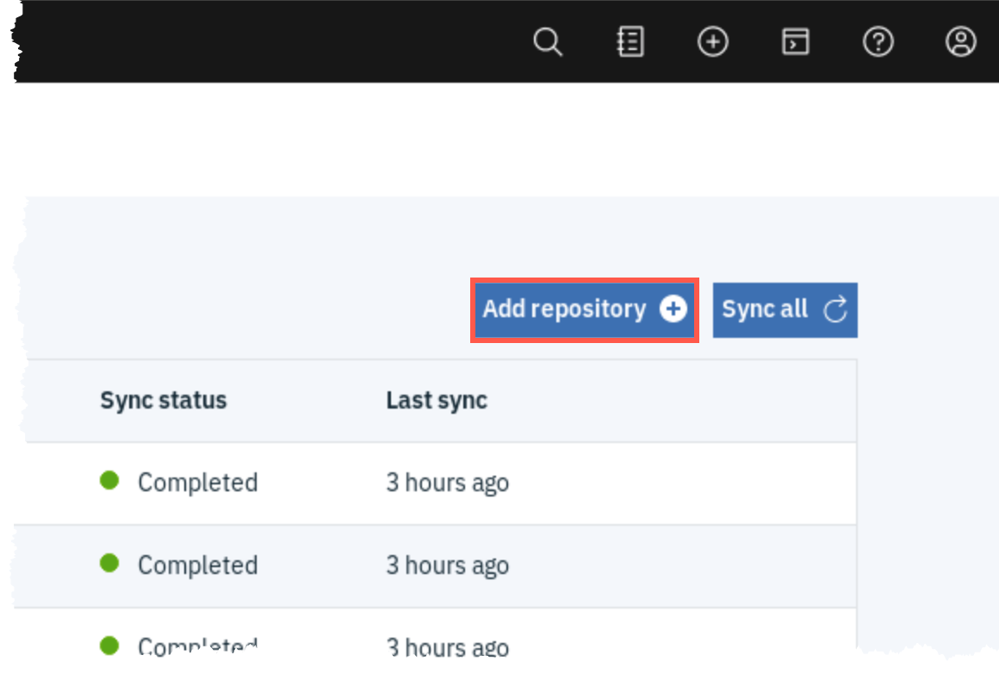

3. Enter **dte-charts** (1) as repository Name, and enter **https://raw.githubusercontent.com/dymaczew/charts/master/repo/incubator** as URL (2). Click **Add** (3).

  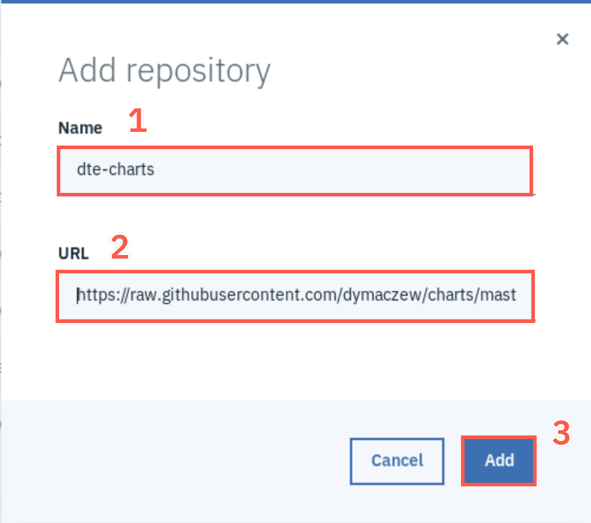

4. After few seconds, you should see Sync Status as **Completed** (1). Now, let’s deploy an application from this new Helm repository. Click **Catalog** (2) on upper right corner of the page to view the list of helm charts that you can deploy.

  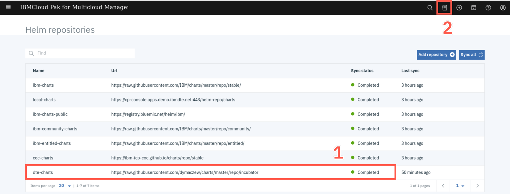

5. Search for **mod** (1) and select **modresortapp** (2) application.

  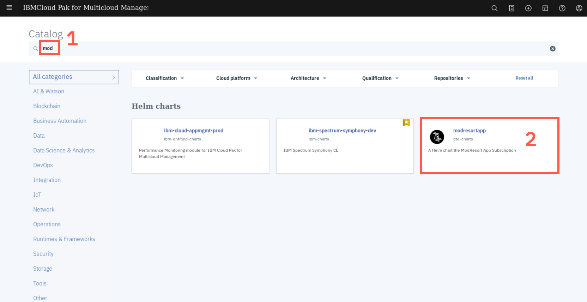

6. The chart deploys a simple Liberty web application for demonstration purposes. Select **Configure** to continue.

  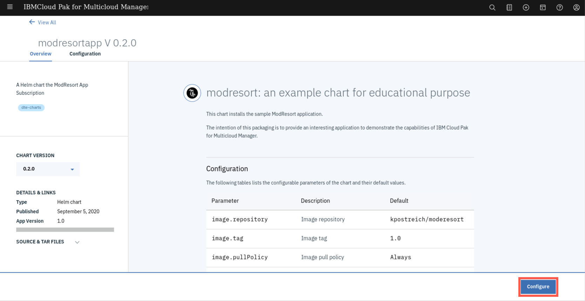

7. Enter **demo** as Helm release name (1), select **default** as Target namespace (2). On Target cluster, select the **local-cluster** (3). Then click **Install** (4).

  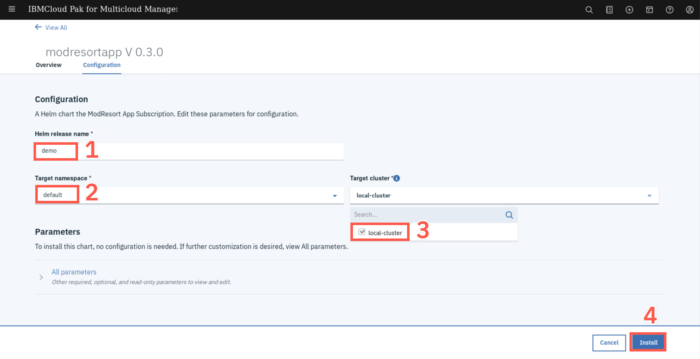

8. The installation starts immediately but it takes a few minutes to deploy the application to remote cluster. Click **View Helm Releases** to view the status.

  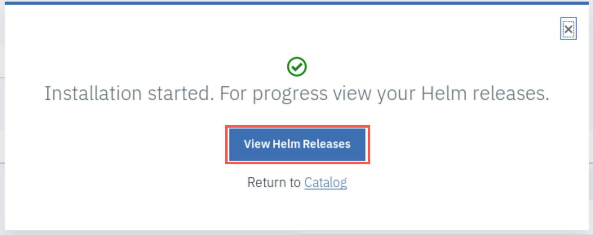

9. On the Helm releases page, you can check that **demo** helm is deployed to your Hub cluster.

  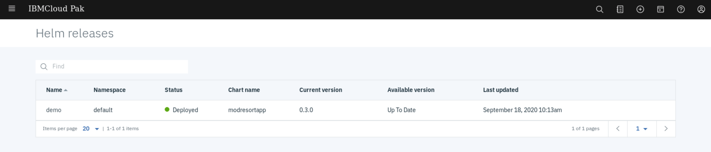

10. Now, go back to the **Hybrid applications** menu ("hamburger" -> Manage Applications -> Hybrid Applications). You can notice that now it shows your just deployed application. Click the **demo-modresrtapp** application.

  NOTE: If the Hybrid Applicatiuons view is not showing the app it may be related to the bug in a code. Go to the Overview page ("hamburger" -> Observe environments -> Overview) and scroll down. In the Applications section you should see a **demo-moderesortapp**. Click the link and continue.

  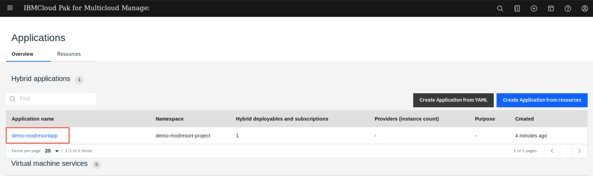

11. You should see the details of the sample application, as shown below. Click on any of the icons to see the details of each object.

  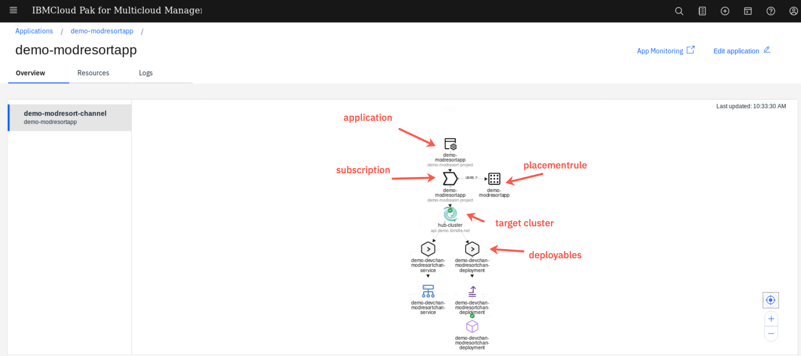

12. Click the **demo-modresortapp** placement rule (1) and notice that it defines the placement of the application to the clusters with label **environment=Dev** (2). It also specify that one instance of the application should be deployed in case more clusters is labeled this way.

  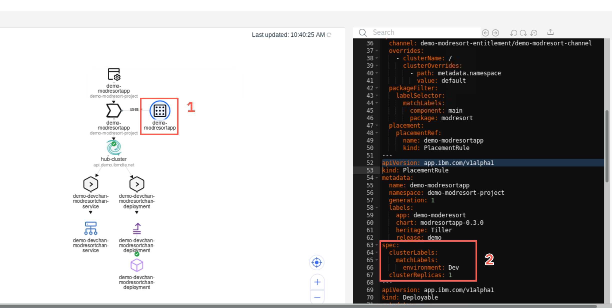

13. Let's modify the target cluster. Edit the label in the yaml file on the right (1) changing the **Dev** to **QA** and apply the changes with the **Update** icon (2)

  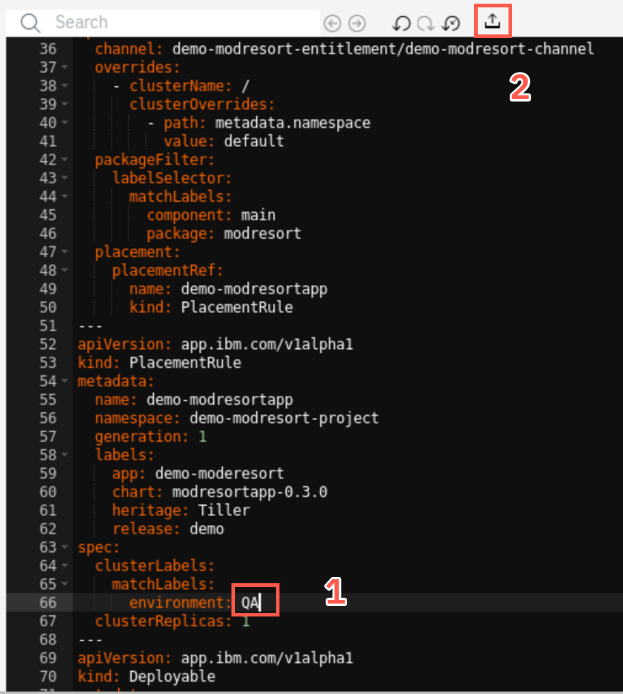

14. In a short time you should notice that the placement rule change is picked by the system and the different target cluster is designeted as a target for deployment.

  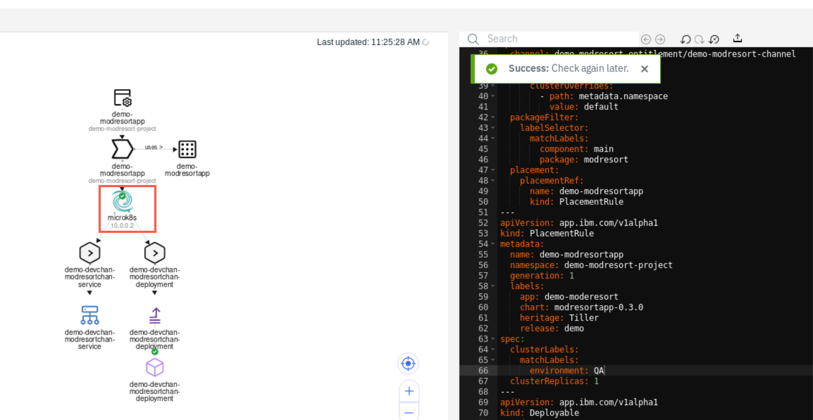

15. Let's verify that the application is actually running on MicroK8s cluster. Go back to the yellow **MicroK8s** terminal windows and run the following commands:

  ```sh
  oc get pods -n default
  oc get service -n default
  ```

  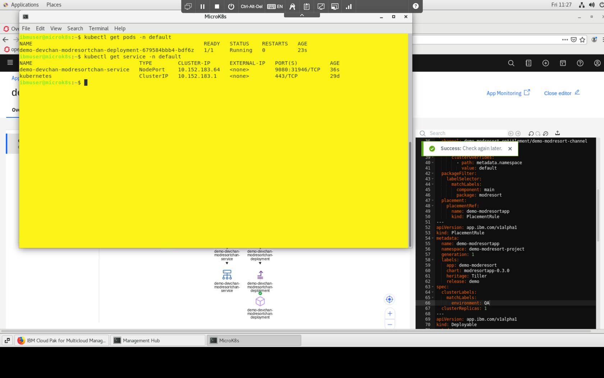

16. Notice the **Node port** used by the service. In the example screenshot it is `31946`

  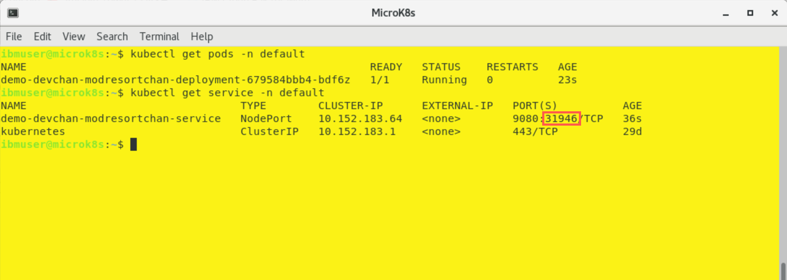

17. Go back to your browser window, open a new tab and provide the following URL `http://microk8s.demo.ibmdte.net:[port-number-from-previous-step]/resorts`

  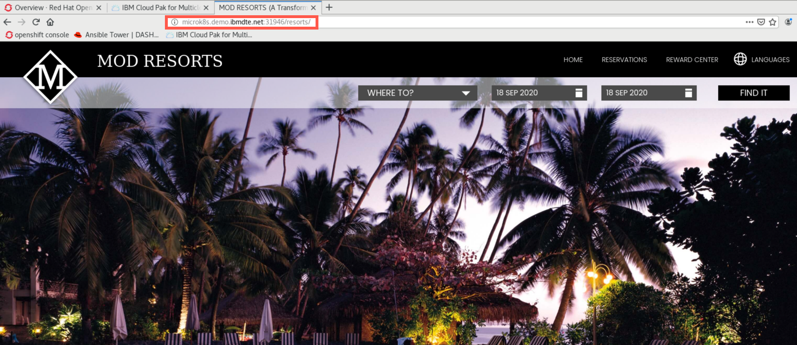

18. Great! Your Liberty application is available on your managed cluster.

  This application is really a simple sample, just to show you how easy is to install an application from the catalog in multiple clusters. In our next lab you will deploy a hybrid application learning details about Application Management deployment using channels and subscriptions concepts.

***

## Manage Cluster Objects

You can use the management console to create, manage, view details, and troubleshoot application resources and Kubernetes objects in all clusters from a single interface. The management console search page supports searching for application resources by the component kind for each resource.

1. Back to the IBM Cloud Pak for Multicloud Management web page tab, click on the **Search** button.

  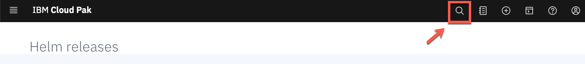

2. The Search menu gives access to application resources and Kubernetes objects across all managed clusters. It is really powerful feature allowing you to easily find any resource in your IT infrastructure - no matter where it is actually located - public or private cloud. The Search overview screen displays commonly used search filters - a pre-defined templates to view workloads, unhealthy pods and workloads created in last hour. You can also create and save your own search filters. Click on **Created Last Hour** button.

  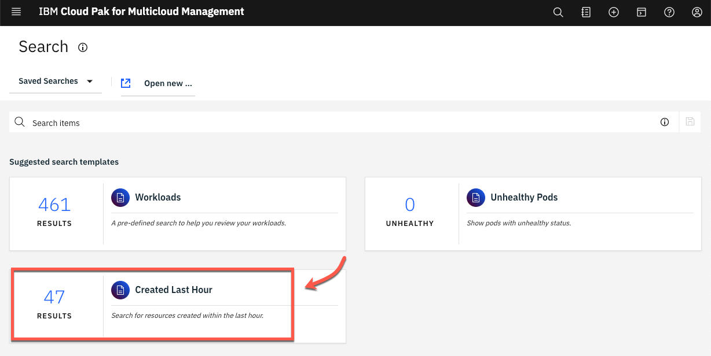

3. If you scroll down to the **Pod** section, you should see the **demo-modresort** pod that you created earlier in the list along with other pods. You can also provide the search criteria in the filter section. For example: type `kind` and select **pod**, provide the `modresort` as search string and specify `status` as **Running**.

  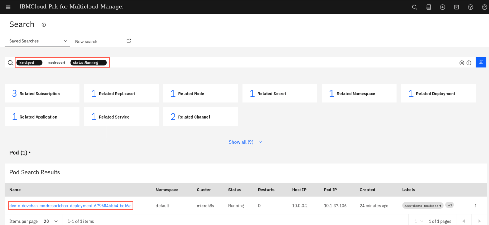

  Congratulations! You have successfully completed the lab “Multicluster Management with IBM Cloud Pak for Multicloud Management”.

***

## Summary

You completed the Cloud Pak for Multicloud Management tutorial: Multi-cluster Management. Throughout the tutorial, you explored the key takeaways:
- `Understand Cloud Pak for Multicloud Management`;
- `Add a managed cluster`;
- `Deploy an application`;
-	`Manage and monitor application resources of local and remote clusters`;

If you would like to learn more about Cloud Pak for Multicloud Management, please refer to:
-	<a href="https://www.ibm.com/cloud/cloud-pak-for-management" target="blank">Cloud Pak for Multicloud Management home page</a>
- <a href="https://www.ibm.com/demos/collection/Cloud-Pak-for-Multicloud-Management" target="blank">Cloud Pak for Multicloud Management Demos </a>
