## Chapter 6 : イベント管理 と Runbook Automation

IBM Cloud Pak for Multicloud Managementのモニタリング・コンポーネントには Event Managmentコンポーネントが統合され、管理対象であるリソースやアプリケーションで発生した インシデントやイベントへの対応を、自動化/半自動化していく機能を提供しています。複数のクラスター環境を横串に把握し、モニタリングから必要な方法を得て、問題を特定します。イベントは、アプリケーションやサービス、そのほか監視している対象で発生した事象です。  
Event Managementはオンプレミス、クラウドに関わらず、多様な監視対象からイベントを受け取ります。特定のアプリケーションや特定のクラスターに関連するイベントは、インシデントに関連付けられます。  

このハンズオンでは、あなたは運用サポートチームのリーダーとして、問題の解消に責任を持っています。あなたは、作業手順 Runbook を Ainsble を利用して用意し、問題の解消に当たります。  
このチュートリアルでは、**MCMHubCluster**にログインして、以下の作業を実施します。

- 運用サポートグループを定義する
- Slack統合を構成する
- Eventポリシーを定義する
- Incidentポリシーを定義する
- EventManagementに Ansible Towerを統合する
- Runbook Automationを構成する
- Runbook Automationをテストする

---

## 運用サポートグループを定義する
このハンズオンでは、ユーザー・アプリケーションに関するイベントに対応していきます。  

1. IBM Cloud Pak for Multicloud Management の メニューから **Administration > Monitor** と進み、モニタリング・コンポーネントの管理画面を開きます。

1. モニタリング・コンポーネントのイベント管理機能を利用するユーザー・グループを確認します。  
**Users and Groups**にカーソルをあわせると **Work with Users and Groups**とメッセージが変わりますので、そこをクリックします。

    
1. すでに何人かユーザーがいることを確認してください。**Operations Lead**（運用チームリーダー）のロールのユーザーがいます。これらの**Operations Lead**には、自動的に ClusterAdministratorの権限がアサインされます。

1. 他のユーザーを追加登録しましょう。デモ環境では LDAPがすでに統合されていますので、LDAPに事前に登録されているメンバーを Cloud Pack for MCM環境にインポートします。
    1. メニューより、**Administter** > **Identity and accesss** を開きます。
        
    1. **Teams**タブを開き、すでに作成されている **Operations**チームを開きます。
        
    1. operationsチーム管理ページで。**Users**タブを開きます。 Usersタブ内で、右上にある 青い**Add Users**ボタンをクリックします。
        
    1. **Select domain**のドロップダウン・メニューから**my_ldap**（事前構成されているLDAPインスタンスの名前）を選びます。
       なお、Cloud Identity Directoryは、OpenShiftのデフォルト認証の名前です。
        
    1. 検索ボックスで **carlos**と入力してEnterを押し、表示された CarlosCNを選択します。ロールに**Editor**を指定して、右上の青い**追加＊＊ボタンをクリックします。
        
1. 次に新規に登録した **Carlos**がメンバーとなるグループ**Supprt Group 01**を作成します。
    1. モニタリング・コンポーネントのユーザー・グループを管理のページに戻ります。メニューから **Adminisiter** > **Monitor**を開き、**Users and Groups**を選択します。
        
    1. **carlos**が **Operations Engineer**（運用エンジニア）のロールとして、リストに追加されていることを確認します。
    
    1. **Groups**タブを開きます。現在は定義されているグループはありません。**New group**をクリックして、グループを新規作成します。
    
    1. **Support Group 01**をグループ名に指定し、**Assigin Users**をクリックして、**carlos**にチェックを入れて、**Assign**をクリックします。
    
    1. 内容を確認して、**Save**をクリックします。
    

***

## Slackの統合を確認する
運用チームは、さまざまな通知方法を利用することができます。メールを好む方もいるかもしれませんが、現在では PagerDutyや Slack、Microsft Teamsなどのコラボレーションが好まれます。  
このハンズオンでは Slackを利用して、ChatOpsを試してみましょう。

1. メニューから **Administer** > **Monitoting**を開き、モニタリング・コンポーネントの管理画面を開きます。

1. 一番上にある **Interatios**をクリックします。
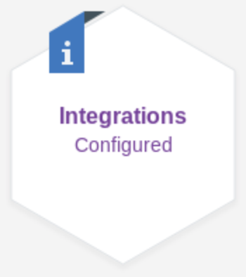
1. **Incoming**タブでは、このイベント管理機能に入ってくるイベントのソースを定義しています。すでにいくつか統合されているものもあります。  
たとえば、**local-cluster**のIBM MCM Compliance ManagerやIBM Cloud Application Performance Managementがあります。

1. その他、統合可能なものを確認するには、**New Integration**をクリックします。OSSや3rdベンダー含め、多様なツールが統合可能になっています。

1. **Integration**のページに戻ります。**Outgoing**のタブから、集約されたイベントの通知先を指定していきます。右上にある**New integration**をクリックします。

1. OutOfBoxで統合可能なツールがあります。利用しているものがない場合には、一般的な**Webhook**を利用することもできます。

1. このハンズオンでは、すでに 事前に用意されているSlackを利用します。
    1. まず 連携用のSlackチャネルを用意します。
    1. Slackのボタンを選び構成を確認し、**Configure**をクリックします。
    
    1. Outbound Integration名に 任意の名前を付けます。ここでは `MCM2Slack`としています
    1. Slack の Webhook URLを指定します。WebHook用のURLは、上の手順でメモしたものを指定します。
    
    1. Saveをクリックします。
    

1. Integrationの**Incoming**のタブに戻ります。イベントの統合元の右端に、**Sample events**がありますので、これを利用してサンプルイベントを発生させます。

1. **Success Notification**の通知が出て、サンプルのインシデントが生成されたことを確認します。数分待つと、チャネルに通知が届くはずです。
.

***

## インシデント・ポリシーの定義
ここでは、新規作成された運用サポートグループ**Support Group 01**に、オンライン・バンキング・アプリケーションのインシデントを自動的に関連付けるポリシーを作成します。

1. モニタリングの管理画面から **Policies**ボタンをクリックします。

1. ２種類のポリシー **Event policies**と**Incident policies** と **Lookup tables**が存在します。

|タブ|説明|
--|--
|イベント・ポリシー|イベントをシステムがどうハンドルするかを定義します。データ・コレクターやモニタリング・エージェントがイベントを生成したり、連携した様々な外部ツールからイベントを受け取ります。属性に基づいて、イベントはインシデントへと集約することが可能です。|
|インシデント・ポリシー|インシデントの優先順位と、どのチームにインシデントをアサインし、どう通知を受けるかを定義します|
|ルックアップ・テーブル|イベントが発生した際に、関連付けを行いたい属性（担当部署や連絡先など様々な情報）を定義します

1. イベント・ポリシーとして、デフォルトで２つのポリシーが事前定義されています。
    
1. インシデント・ポリシーのタブを開きます。すでにいくつかのポリシーが事前定義されています。
     
1. ここでは、オンライン・バンキングに関連したインシデントを、運用サポートグループ**Support Group 01**にアサインするポリシーを作成します。
    1. 右上の**New incident policy**をクリックします。
        
    1. ポリシー名 `Online Banking Incident Policy` を指定します。
    1. Incidentsセクションにおいて、**Specify conditions**（条件を指定）を選びます。条件として、**Priority is higher than Priority 3**を指定し、重要度が低いインシデントは省きます。
        
    1. **Add condition to describe incident events**に オンライン・バンキング関連のイベントが含まれるように定義します。
        
    1. フィルターの結果をテストすることができますので、過去３日のデータで、意図した挙動となるか確認します。
        
    1. 今回の環境では、最低１件イベント（さきほどのサンプル・イベント）が引っかかれば正しい挙動です。
        
    1. **Action**セクションで、**Assign and notify**（アサインと通知）を選択し、**Add assignment / notifications**の黒いボタンをクリックします。
        
    1. 先ほど作成した **Support Group 01**を選択し、**Notify**にチェックをいれます。
        
    1. **Integration**タブも開き、先ほど作成した**MCM2Slack**の統合にもチェックを入れます。
        
    1. **Apply**をクリックします。
    1. **Enable**を On に変更し、**Save**をクリックします。
        
1. 新しいインシデント・ポリシーが定義できました。ポリシーは、画面で見えている順に評価が行われます。順序を変更したい場合には、右端の**︙**をクリックして、**Move up**や**Move down**で順番を入れ替えます。
ときに評価の順序は重要です。順序が正しくないと、たとえばより上位のポリシーで、Priorityが変更されてしまい、実質的に使われないポリシーができてしまうかもしれません。

***

## Configure Ansible Tower

   In this section you will configure Ansible Tower. With Red Hat® Ansible® Tower you can centralize and control your IT infrastructure with a visual dashboard, role-based access control, job scheduling, integrated notifications and graphical inventory management. Ansible Tower is embeded into Cloud Pak for Multicloud Management to drive automation of event response with runbooks and is also used for configuration and compliance automation within infrastructure module.

1. Open a new browser tab and use the Ansible bookmark to open Ansible Tower interface.

   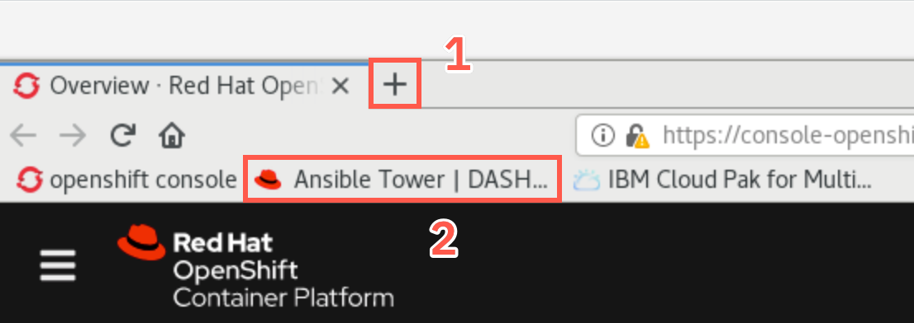

2. Provide `admin` as username and paste the password using Skytap stored credentials. IF THAT DOES NOT WORK (TEMPORARY ISSUE) USE `hemXyAF1frDlbOIxxes2h1ubbTSFtMO4` AS PASSWORD.

   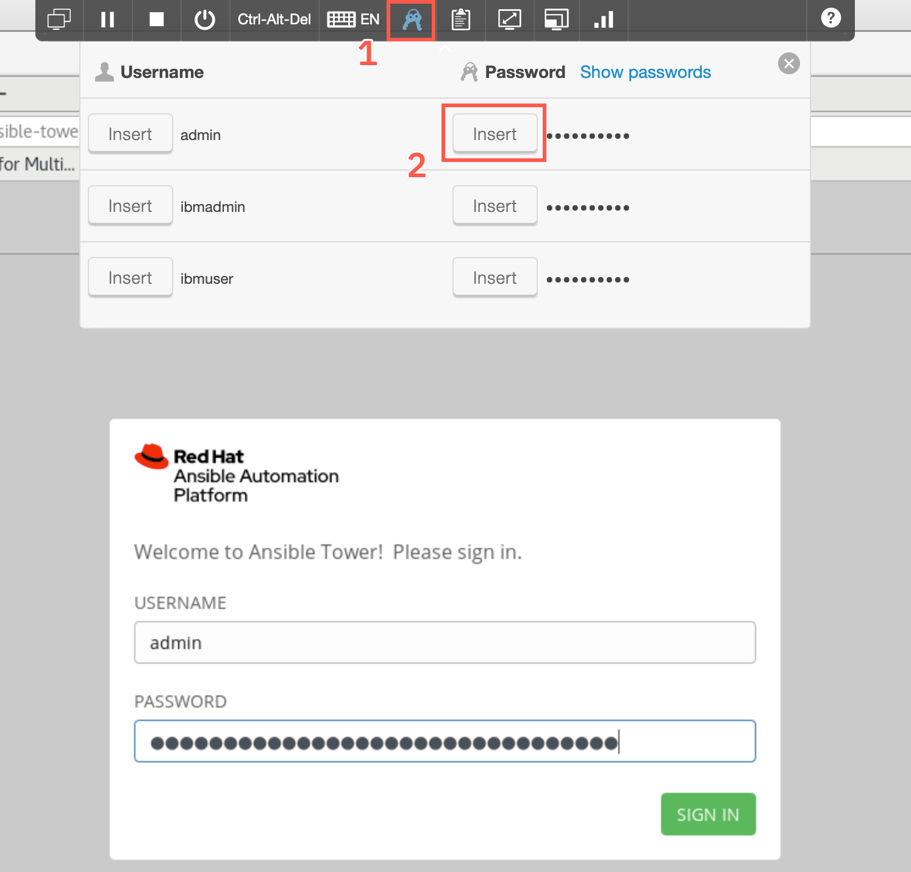

3. First, you need to define a credentails to be used with the target environments. Select **Credentials** from the menu and then click '+' sign to add new credentials.

   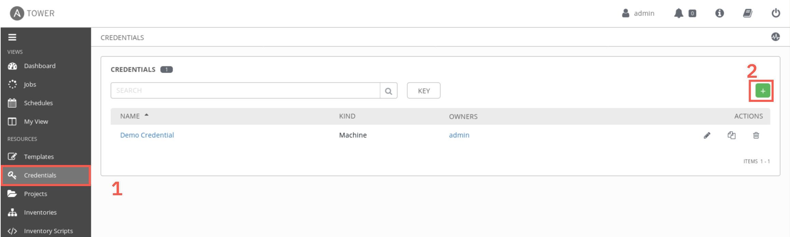

   You will add 2 different type of credentials. First let's add a credentials to the vcenter that allows Ansible Tower to collect data from the Vmware vSphere environment. Later, you will add credentials to specific virtual machines, to allow running Ansible playbooks on these VMs using ssh.

4. Provide a name (e.g. `vcenter`) (1), select the Organization `Default` (2), then select the **Credential type** lookup (3) to pick the **Vmware vCenter** option (5) available on the last tab of the list (4). Then click **Select**.

   Then, provide `10.0.0.100` as **Vcenter Host**, `administrator@vsphere.local` as **Username** and `P@ssw0rd` as **Password**. Finally, click **Save**.

   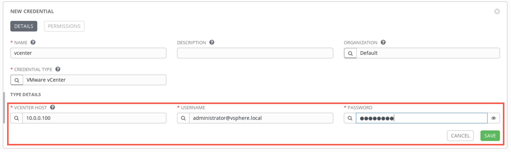

5. To add the second credentials, click the '+' sign again, and provide name (e.g. `ubuntu`). This time select type `Machine` and provide `ibmuser` as **Username** and `passw0rd` as **Password**. You can notice it is also possible to provide the SSH key as a credentials, but you won't use this method in this tutorial. Scroll down and click **Save**.

   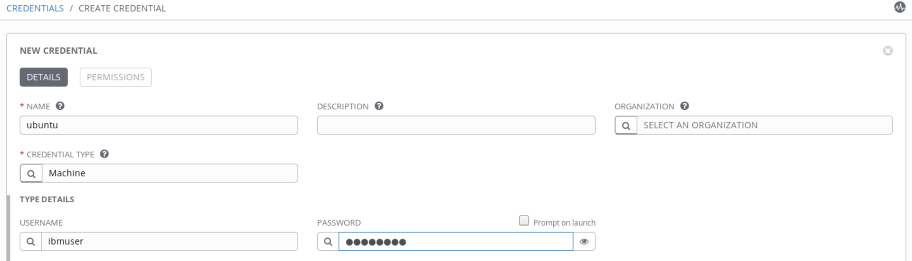

   Finally, create a third set of credentials, named `desktop`, with user `ibmuser` and password `engageibm`.

6. Now, let's add new Inventory. In the menu select **Inventories**.

   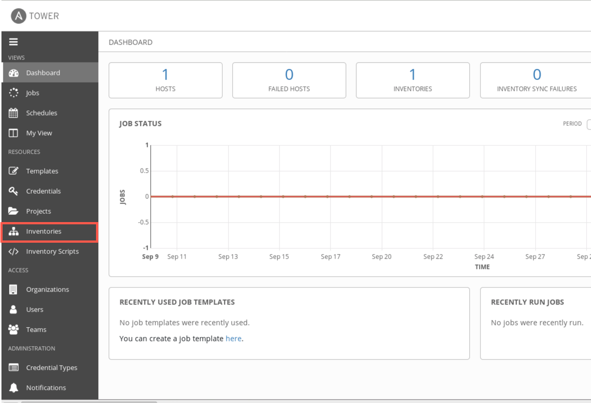

7. An Inventory is a collection of hosts against which jobs may be launched. To create automation you must first define a set of target hosts as Inventory and assign the credentials that Ansible will use to connect to the target system. You can define a static inventory for a well known hosts in your infrastructure, as well as dynamic inventory that will be automatically populated with the virtual machines provisioned in a public or private cloud. Let's start with dynamic one. Click '+' sign on the right and select **Inventory** to create a new inventory.

   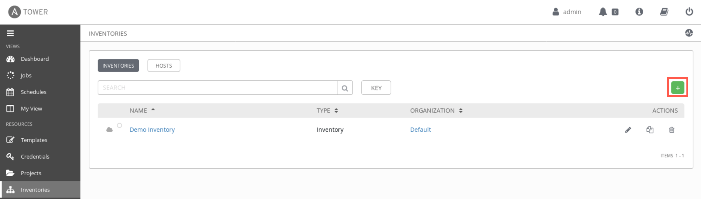

   Provide the name `vmware` and click **Save**

   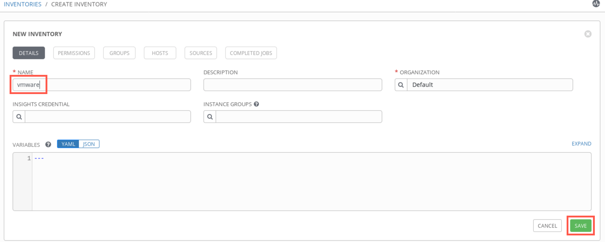

   Now, select **Sources** tab (1) and click '+' sign (2) to add new source.

   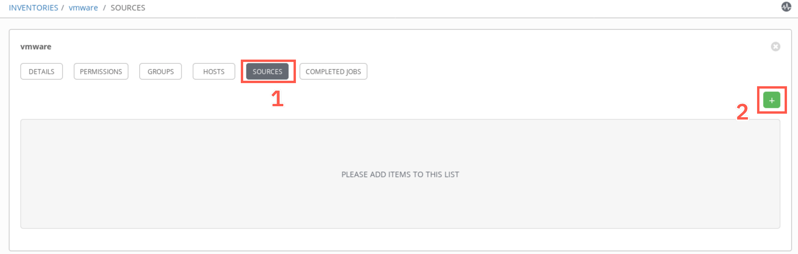

   Provide a name (e.g. `vcenter`) and select **Source** `VMware vCenter`.

   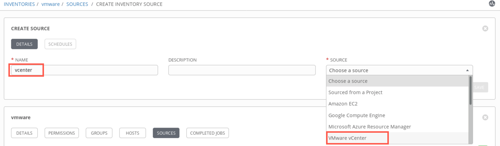

   Credentials `vcenter` should be populated automatically, as there is only one entry of this type defined. If you have defined more, select the credenitals defined in step 4 above. Then, click **Save**

   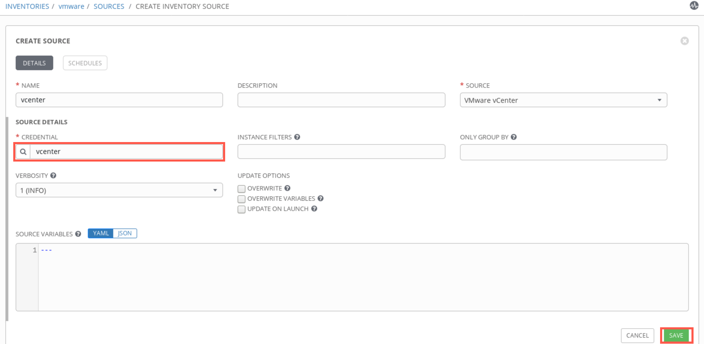 

8. On the Sources view, select the **Sync** icon (1) to pull inventory details from Vmware environment. When the sync job completes, you should see a green cloud icon next to the source name (2).

   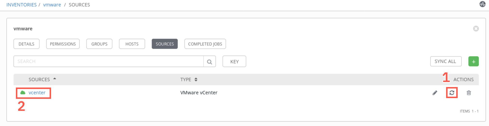

9. Now, add the static inventory for other hosts. Add new inventory but this time provide the name `static`, click **Save** button and then instead of sources tab, select `hosts`. Then click green '+' sign on the right to add a new entry. Provide `10.0.0.10` as **Host name** and click **Save**.

   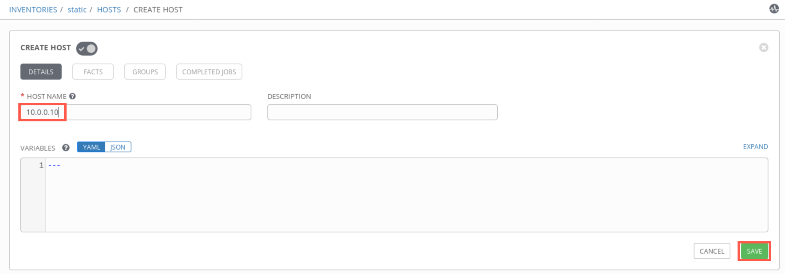

   This host is the desktop, in the next excerices you will run Ansible jobs on that host as a part of automation. However, before you can do this, there is one more step required: you need to add playbooks to your Ansible Tower.

***

## Configure Ansible playbooks

   Ansible is a very popular open-source automation tool, with a large number of available automation scripts called playbooks. Ansible basics are outside scope of this tutorials so you will just use the pre-defined sample playbook. To learn more about Ansible visit [Ansible website](https://www.ansible.com)

   Sample playbook that you will use as the automation action triggered in response to the event is meant to create a sample file at the target host. It emulates the real action which normally one would take - for example to restart failing application.

 1. In order to add a new playbook with automation scripts you have to first create a project. From the left-side menu select **Projects** (1) and click '+' sign to add a new project (2).

   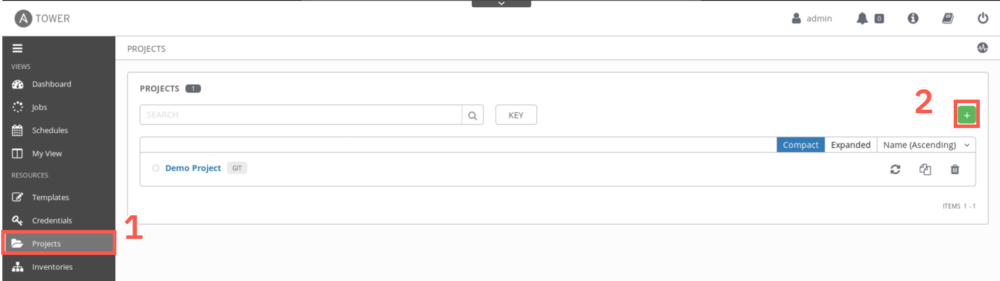   

2. Provide the name of the project (e.g. **runbook-automation**), select **Git** as SCM Type and enter **https://github.com/dymaczew/rba-ansible-sample** as SCM URL. When done click **Save**. This action starts in the background process of retriving content of the repository. If the syncronization is successful, you should see a green dot next to the project name as pointed by the arrow on the screenshot below

   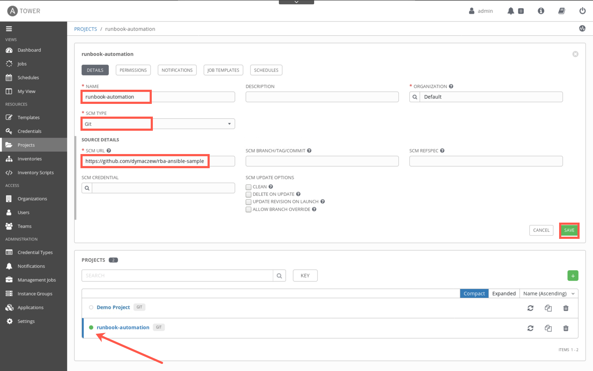

3. Now, you need to create the job template within a project. Select the **Job templates** (1) tab and click '+' sign (2) to add new **Job template**.

   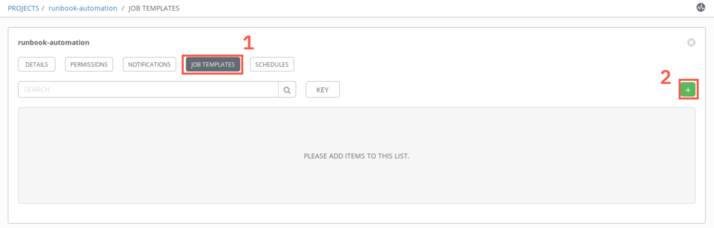

4. Provide the following details on a Job template creation form:

   - Name: **Start_Online_Banking**
   - Inventory: **static**
   - Credentials: **desktop**
   - Verbosity: **0 (Normal)**
   - Project: **runbook-automation**
   - Playbook: **start-online-banking.yaml**

   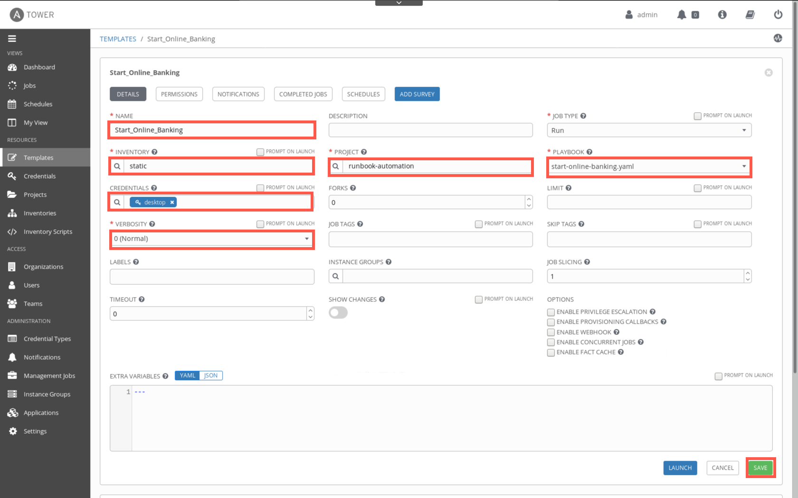

   As you can see, there is a lot more different options available to customize the job execution, but you will not explore them in this tutorial. When ready with the inputs, click **Save**.

   This completes the Ansible preparation part. You have defined the automation task, created inventory file and provided credentials. Now, let's define the trigger which executes this action when the specific event occurs.

## Configure Runbook automation

   Runbooks are automated, semi-automated, or manual procedures capturing the organizational knowledge of how to diagnose and resolve different types of incidents. IBM Cloud Pak for Multicloud Management allows you to define and use runbooks, leverage automation through scripts but also integrate with multiple automation tools, like Ansible Tower or BigFix. In this section, you explore these capabilities.

1. You should be in the Administration view. Click **Runbooks** tile

   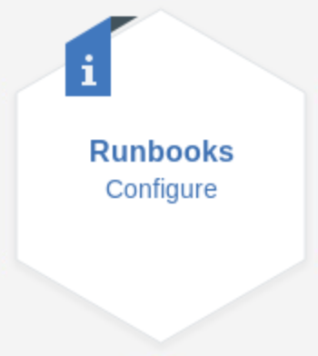

2. Click **Connections** tab. Connections let you define automation tools that you want to use in your runbooks. Here you will define a connection to Ansible Tower

   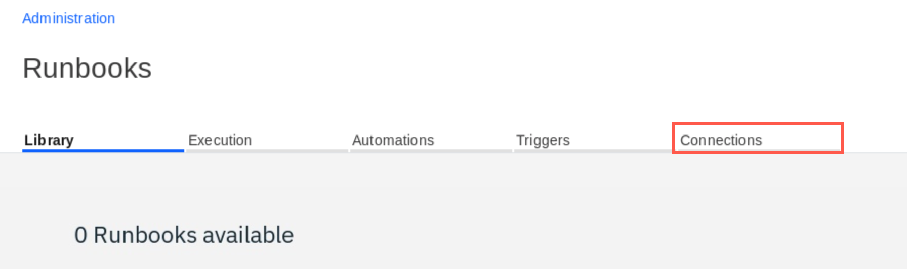

3. Click **Configure** under the Ansible Tower tile.

   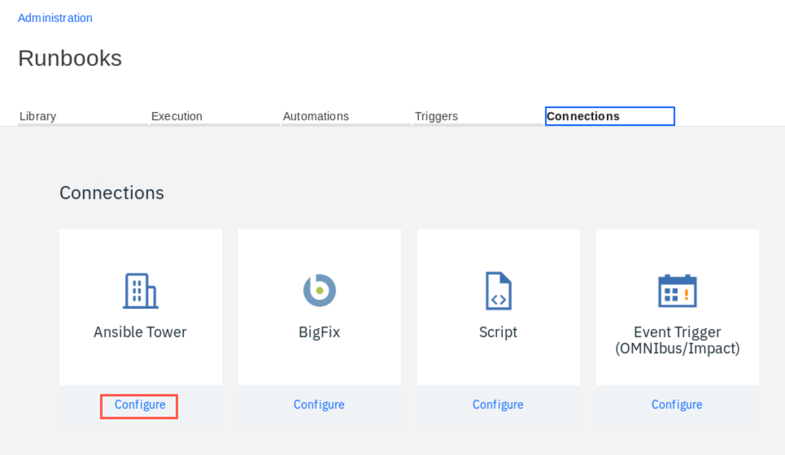

4. Enter Asible Tower URL: `https://ansible-tower-web-svc-ansible-tower.apps.demo.ibmdte.net`, provide `admin` as user and insert the password using the stored credentials from the Skytap menu. Finally click **Save**.

   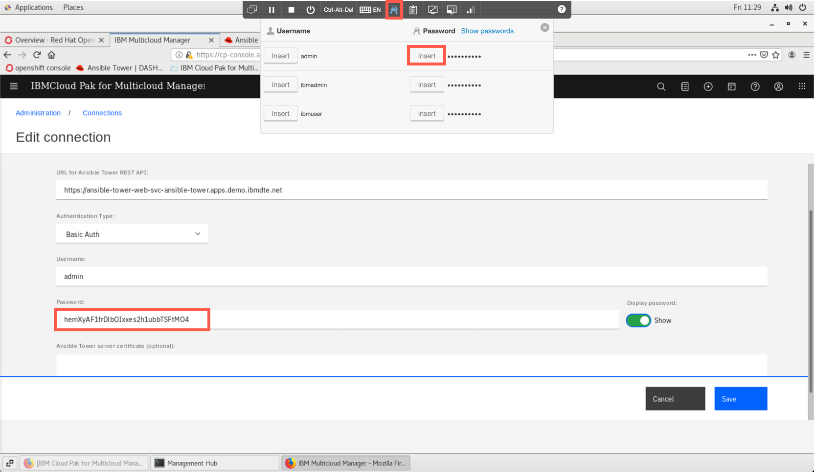

5. If you entered the credentials and URL correctly, you should see the green checkmark next to the **Connected** shown under Ansible Tower tile.

   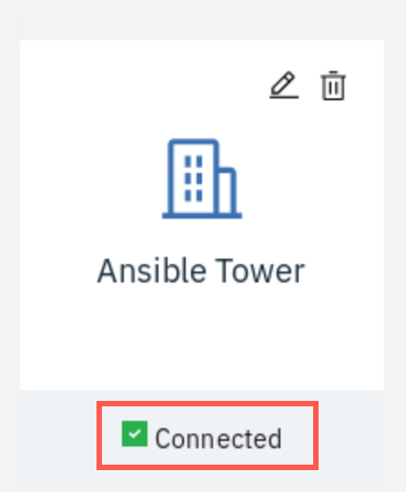

6. Now, select the **Automations** tab and click **New automation**.

   Automations are predefined tasks that can be invoked by the operator manually during the incident or executed automatically in response to the incoming events. Select **Ansible Tower** as type, provide name and select **Start_Online_Banking** template as shown below. Finally click **Save**

   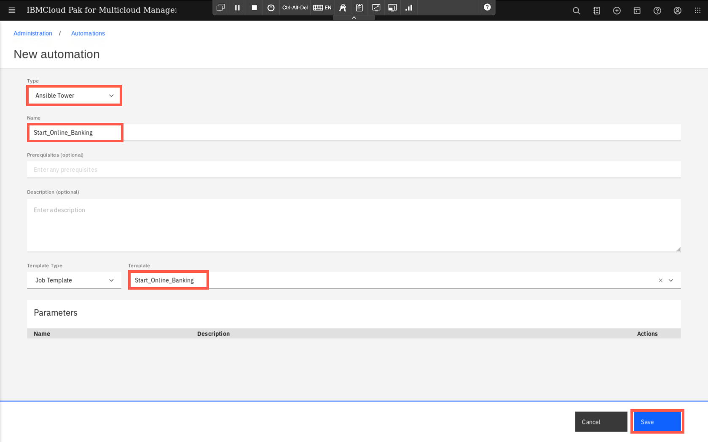

7. Next, you need to add a runbook. Select **Library** tab and click **Add runbook** button.

   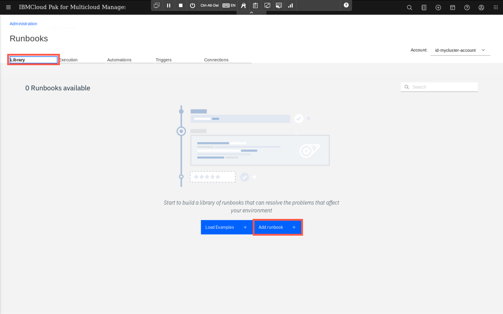

8. Provide the name and secription. Below, there is an editor allowing you to define a runbook content. You can define multiple steps, provide commands to be run along with the guidence for the operator who will use this later. You can also call automations and this is exactly what we want. Click the **Automation** icon to add previously defined automation to the runbook.

   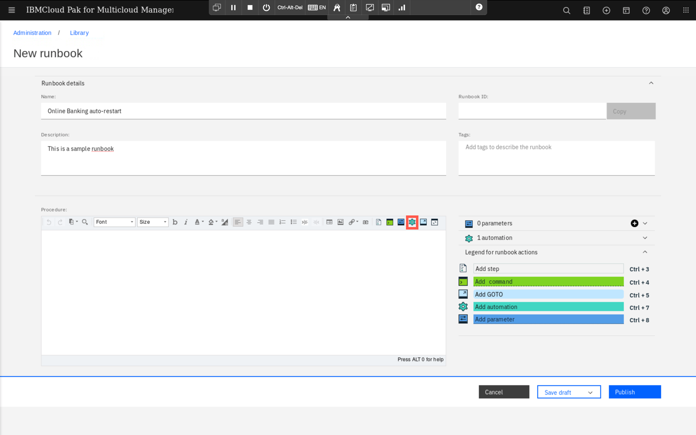

9. Click '+' sign next to **Start_Online_Banking** automation on the list to add automation to the runbook. On the dialog that pops up click **Apply** to confirm.

   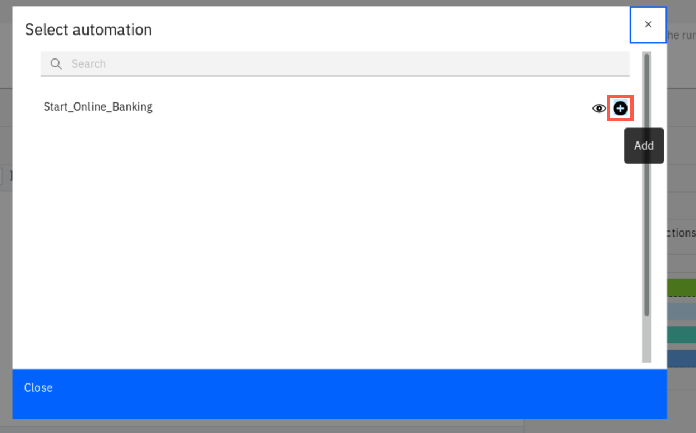

   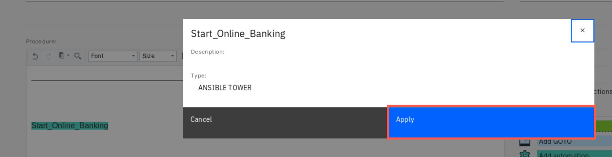

   Finally, click **Publish** to complete defining the runbook.

10. Finally, you need to connect the runbook with the events. This is done with the Event Policy. Go back to the **Administration** tab and select **Policies**. Previously you have used this to define incident policy that sends out Slack notifications. This time you add a new event policy. Click **New event policy**.

    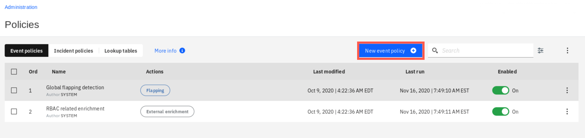

11. Provide the name and description.

    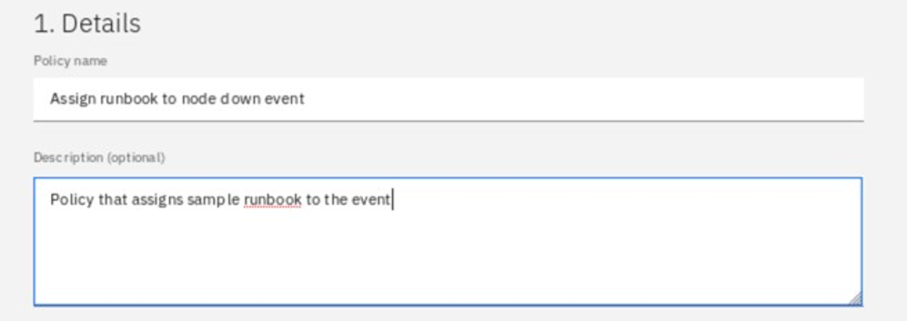

12. In the events section select **Specify conditions** and for **Condition 1**, change the attribute to **Summary**, select **"contains"** for the operator, and enter **"node process not running"** as the value.

    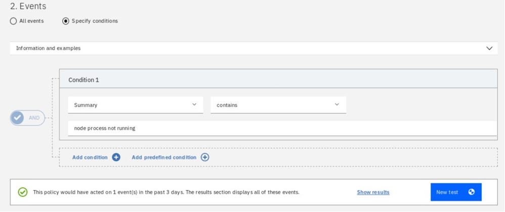

    You can test the condition to verify that you haven't made any mistake.

13. Scroll down to **Action** section. Select **Assign runbook**, and then click **Add runbook assignment**.

    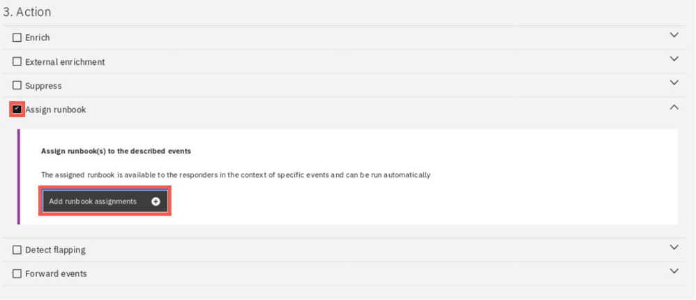

14. Select the available runbook and click **Apply**. Then, select **Automatically run this runbook** checkbox and click **Save**.

    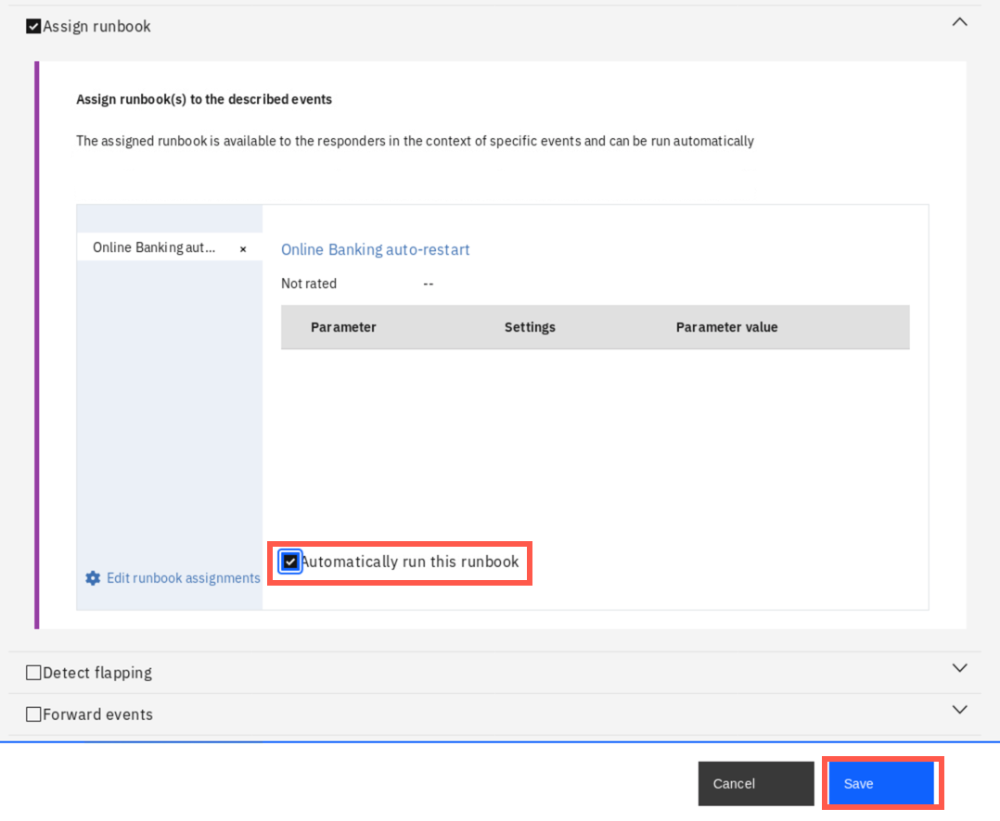

15. If you haven't enabled the policy yet (it was possible during definition step), toggle the **Enabled** switch.

    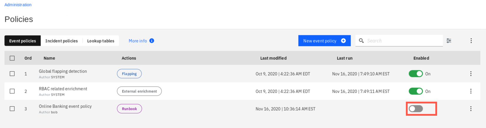

    This concludes the definitions. Now, let's check how it works in action.
***

## Test runbook automation

1. Go back to the **Administration** tab and select **Integrations**. Generate again sample events. Now, go back to **Administraton** and select **Incidents** tab. Select **All incidents**

   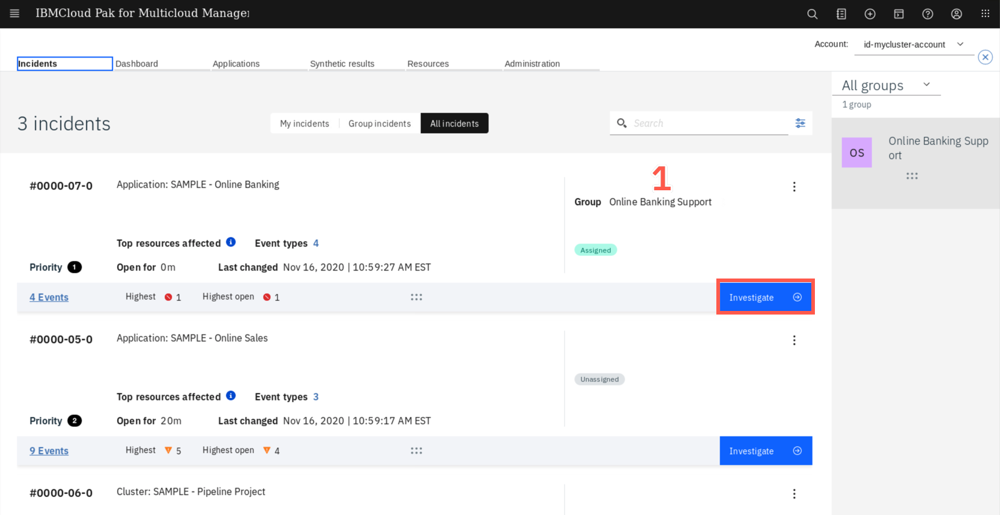

   You can notice, that the incident related to the Online Banking application was automatically assigned to the Online Banking Support group. Click **Investigate**

2. In the Resolution view, you should see that the Slack notification was send out (1), as well as that the runbook was assigned and successfully executed by the event policy.

   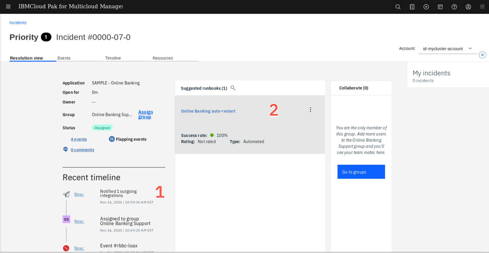

3. To confirm, open the Management Hub terminal on the desktop and look for **rba-result.txt** file.

   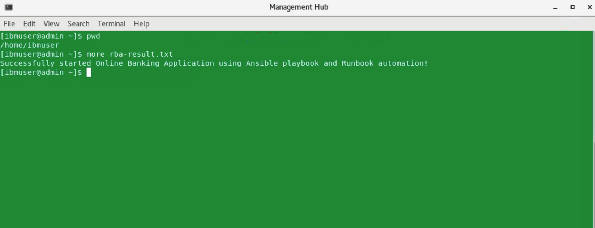

4. In case something went wrong and you would like to look at the details of the Ansible execution log, you can go the the Ansible Tower, or withing the Cloud Pak user interface, go to the **Administration** tab, **Runbooks** tile and look at the Executiuon tab. Here you can find the detailed log of each execution of any of the automations you defined.

   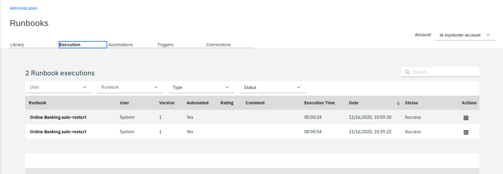

   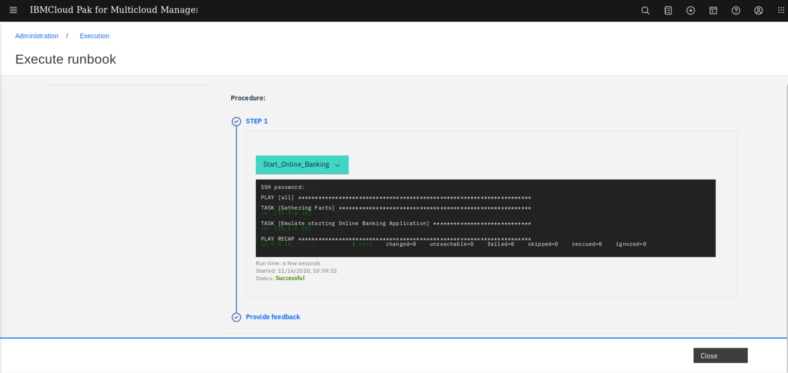

   Congratulations ! You have reached the end of the tutorial.

***

## Summary

You completed the Cloud Pak for Multicloud Management tutorial: Multi-cluster Management. Throughout the tutorial, you explored the key takeaways:

- `Define a new support group and assign specific incidents to this group`
- `Create incident policy that automatically send notifications to Slack channel`
- `Configure Ansible Tower and define new Runbook automation`
- `Create event policy that automatically runs Ansible playbook in response to the event`
- `Generate sample events to verify that your new policies work as expected`

If you would like to learn more about Cloud Pak for Multicloud Management, please refer to:
-	<a href="https://www.ibm.com/cloud/cloud-pak-for-management" target="blank">Cloud Pak for Multicloud Management home page</a>
- <a href="https://www.ibm.com/demos/collection/Cloud-Pak-for-Multicloud-Management" target="blank">Cloud Pak for Multicloud Management Demos </a>
