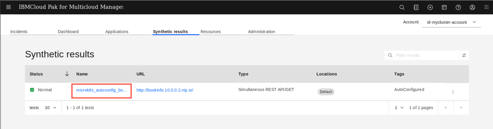
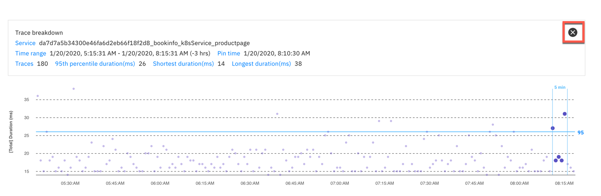
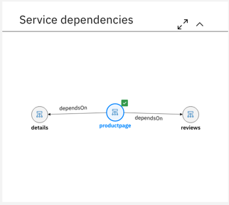

# Chapter4 インフラストラクチャ・モニタリング

## シンセティック・モニタリングとゴールデン・シグナル
クラウドネイティブ環境では、従来の基盤チームがになってきた基盤モニタリングだけでなく、提供しているビジネス・アプリケーションの挙動も理解し、ユーザー体験を改善していく必要があります。  
2020年末の IBMによるInstana社買収により、この**アプリケーション・パフォーマンス・モニタリング** および **Observablity**の領域は、今後 強力な機能強化が予定されています。  
別Chapterにて **IBM Obserbability with Instana**の演習を用意していますので、時間がない場合は、ここで Instanaの演習に移ってください。  
まだハンズオンの時間に余裕がある場合には、引き続き、現在 IBM Cloud Pak for Multicloud Managementのモニタリング・コンポーネントで なにができるか確認していきます。

1. 演習用に、マイクロサービス・アプリケーション Bookinfo をデプロイします。  Red Hat Advanced Cluster Managementコンポーネントのコンソールを開きます。
1. メニューから **Manage Applications**を開きます。
1. アプリケーションのダッシュボードから、右上にある**Create Appliations**のボタンをクリックします。
1. 以下の定義でアプリケーションを指定し、払出します。
 
|項目|値|
--|--
|name|bookinfo|
|namespace|bookinfons|
|repository|Git|
|Git URL|https://github.com/ICpTrial/bookinfo|
|Git Branch|main|
|Select Clusters deploy to| Deploy application resources only on clusters matching specified labels を選択|
|Label|environment|
|Value|qa|

1. bookinfo のアプリケーションが microk8sクラスターに払出され、各種サービスが立ち上がることを待機します。  
クラスターが定義されない場合は、ラベルの指定を誤っていないか確認ください。特に environment のスペル！

1. 払出されたアプリケーション内に Ingressの定義があり、このアプリケーションは `bookinfo.10.0.0.2.nip.io` の URLでアクセスできるようになっています。  
ブラウザから、このアプリケーションにアクセスできることを確認してください。

***

## シンセティック・モニタリング 

Cloud Pak for Multicloud Managementには、外部からブラックボックスにアクセスして検証することでユーザーの挙動を理解する シンセティック・モニタリングの機能が含まれています。  
シンセティック・モニタリングは、ハイブリッド・アプリケーションの一部として、デプロイされた Ingress を検知し、自動的にモニタリングを開始します。  
確認していきましょう。

1. Cloud Pak for Multicloud Management のメニューから **Monitor Health** > **Synthetics** を開きます。
  

1. シンセティック・モニタリングのページには、Bookinfoアプリケーションの一部としてデプロイされたIngressに対する定義があるはずです。
   

1. モニタリングの間隔を３０分に減らしましょう。アプリケーションをデプロイした直後ですので、検証されるテストデータは少ないかもしれません。

1. Availability（アクセスできたか否か）と と応答時間のグラフを確認することができます。  

1. 応答時間のグラフでは、アクセスにかかった処理の内訳をはあくすることができるので、SSLセッションを確立にかかった時間、ホスト名の名前解決にかかった時間、処理にかかった時間などの内訳を確認することができます。

1. スクロールダウンすると、実際のテスト結果の詳細が分かります。グラフの中の任意のドットをクリックしてみましょう。各テストのタイミングでの状況が分かります。

シンセティック・モニタリングでは、よりユーザーに近い環境にシンセティック・モニタリング用のエージェントを導入して、そこから要求を送ることにより、よりエンドユーザーに近いところで体験を可視化することもできます。

## サービスのゴールデン・シグナルの確認

ここからは、アプリケーション・パフォーマンス監視のひとつのキーである、ゴールデン・シグナルを見ていきます。  
ゴールデン・シグナルは どんな言語でアプリケーションが稼働していようとも、Site Reliability Engineer が問題判別のスタート地点とすることができる パフォーマンスのKPIです。  

1. Cloud Pak for Multicloud Management のコンソールから、Infrastructure Monitoring を開きます。

1. **Resource Types**のタブから、**Kubernetes Services**を開きます。 

 
1. 複数クラスター環境で作成されている Kubernetesサービスのリストが表示されます。

1. 検索バーを利用して、productopage リソースを見つけて、開いてください。  

1. Bookinfo アプリケーションを構成する ProductPage マイクロサービスのページを開きます。

  
  ### デプロイメント・トポロジー
  左上のコーナーには、デプロイメント・トポロジーが表示されています。Infrastructureモニタリングの際にすでに見ていますね。
  ここでは、同じデプロイメント・トポロジーを、ProductPage マイクロサービスのビューのコンテキストで見ることができます。  
  ここで分かるのは、１つのクラスターの中の１ノードにこのマイクロサービスのPodが１つ 稼働しているということです。もしPodをスケールアウトして２つに構成すれば、デプロイメント・トポロジーの図も２つになります。
  色が付いている箇所は、問題が起きている箇所です。

  ### ゴールデン・シグナル 
  右上にある ゴールデン・シグナルを見ていきます。ここでは、Latency（応答性能）、エラー数（Errors）、トラフィック量（Traffic）、リソースの飽和状態（Statuation）の４つを見ることができます。  
  これらは、Site Reliability Engineer （SRE）にとって、もっとも大事なメトリックです。
    1. 応答性能（Latency)のグラフの上に、カーソルを移動させてください。様々なパーセンタイル（50,90,95）での 応答性能を確認できます。  
    応答性能は全体としては高速であっても、数％遅い値があったりするので、このパーセンタイルを利用して、よりよくアプリケーションの挙動を理解できます。
      
    1. 次に、フィルターのドロップダウンリストを選んでください。デフォルトでは、すべてのURLへの要求への応答時間のメトリックを出していますが、特定のURLでのメトリックを確認することもできます。
        
    1. productpage マイクロサービスのURLを選んでください。選んだURLの応答性能データを確認します。  
    1. さらに、"/productpage?u=normal"のURLの右端にあるアイコンをクリックしてください。
      
    1. 以下のような画面が確認できます。これは、選択したURLの応答要求の分散を確認できるチャートです。応答性能になんからのパターンがある場合には、このトランザクションを可視化する画面は役に立ちます。ひとつ要求を選ぶと、さらにその応答時間の内訳けを確認することができます。
     
    1. 右上の "X"をクリックして、応答時間の内訳のウィンドウを閉じます。
     
    1. Latency（応答性能）の右上にある "Latency Options"から、表示するパーセンタイルを変更することもできます。試してみてください。
     
     
   
  ### サービス依存性マップ
  1. 左下には productpageと関連があるサービスが可視化されています。  
  
  サービス依存性マップは、マイクロサービスの 1ホップ・トポロジー（当該マイクロサービスを呼び出しているもの、当該マイクロサービスから呼び出されているもの）を可視化します。  
  productpageサービスでは、"details”サービスと"reviews"サービスへの依存性が存在しています。
  1. "reviews"アイコンをクリックします。"reviews"サービスの１ホップ・トポロジーを確認することができます。"reviews"サービスのゴールデン・シグナルも確認してみてください。

  ### フル・サービス・トポロジー
  1. 多くの場合、1ホップ・トポロジーは、問題原因を解析するには十分なことが多いです。大量のマイクロサービスに圧倒されずに済みます。しかし、もっと詳しく全体をみたいときもあります。  
  その場合には、サービス依存性マップの右上にある **expand to the full screen**アイコンをクリックします。
  
  1. このビューは、製品に内蔵された Agile Service Manager(ASM)と呼ばれる機能で提供されています。ASMは １ホップ以上のトポロジーを可視化してくれます。  
  さらに、当該アプリケーションに対して発生したサービスの追加などの変更も可視化してくれます。変更をきっかけに問題となる事象が発生することも多いですので、これらの変更のトラッキングは有用な機能です。
  

  1. まずは２ホップ・トポロジーからはじめましょう。スクルーんの真ん中中央の数字を"２”に変更し、"Render"をクリックします。
   
  1. 細かくは確認しませんが、トポロジーでより多くのコンポーネントが見えるようになったはずです。これにより、マイクロサービスのトポロジーを確認していけます。  
  必要であれば、トポロジーに Podを表示することも可能です。 表示を 追加/削除するには、**Filter**アイコンをクリックしてください。  
   
  1. ASMは変更をトラッキングするための強力な機能です。この変更には、トポロジーの変更やPodのステートの変更、プロパティの変更が含まれます。  
  ここではアプリケーションに対する変更をしていないのでこまかくは確認していきませんが、自由に 触ってみて下さい。  
  確認がおわったら、ゴールデン・シグナルのビューに戻ります。

## ランタイム情報の確認

パフォーマンスを管理していく上で、ランタイムの内部で稼働するデータ・コレクターによって収集された詳細な追加情報が必要となるときもあります。たとえば、アプリケーションが python, Node.js, Java, Goなどで稼働していれば、軽量なデータコレクターを導入することで、ランタイムの詳細なメトリック情報を得ることができます。

1. デプロイメント・トポロジーで、"コンテナー”をクリックします。
   
1. このマイクロサービスの 詳細なコンテナー・メトリックを確認することができます。コンテナに埋め込まれた データ・コレクターによって取得される詳細なメトリックを確認するには、スクロール・ダウンして、**関連リソース**のビューを確認してください。
   
1. ランタイム・ページは、当該するランタイムに関して、最も重要なメトリックが表示されています。
   
1. 他のメトリックを確認するには、スクロール・ダウンして、**Custom Metrics**を拡大し、フィルターに追加したいメトリックを選んでください。
   
   
***

## Summary
以上で、アプリケーション・パフォーマンス・モニタリングのハンズオンは終わりです。  
You completed the Cloud Pak for Multicloud Management tutorial: Monitoring and using SRE Golden Signals. Throughout the tutorial, you explored the key takeaways:
-	`Understand Cloud Pak for Multicloud Management Monitoring module`
-	`Learn how to add cloud native monitoring to the managed cluster`
- `learn how to gather monitoring metrics from the managed cluster`
-	`Learn how to use SRE Golden Signals to monitor application running on the managed cluster`

If you would like to learn more about Cloud Pak for Multicloud Management, please refer to:
-	<a href="https://www.ibm.com/cloud/cloud-pak-for-management" target="blank">Cloud Pak for Multicloud Management home page</a>
- <a href="https://www.ibm.com/demos/collection/Cloud-Pak-for-Multicloud-Management" target="blank">Cloud Pak for Multicloud Management Demos </a>
