# Chapter4 インフラストラクチャ・モニタリング

## シンセティック・モニタリングとゴールデン・シグナル
クラウドネイティブ環境では、従来の基盤チームがになってきた基盤モニタリングだけでなく、提供しているビジネス・アプリケーションの挙動も理解し、ユーザー体験を改善していく必要があります。  
2020年末の IBMによるInstana社買収により、この**アプリケーション・パフォーマンス・モニタリング** および **Observablity**の領域は、今後 強力な機能強化が予定されています。  
別Chapterにて **IBM Obserbability with Instana**の演習を用意していますので、時間がない場合は、ここで Instanaの演習に移ってください。  
まだハンズオンの時間に余裕がある場合には、引き続き、現在 IBM Cloud Pak for Multicloud Managementのモニタリング・コンポーネントで なにができるか確認していきます。

1. 演習用に、マイクロサービス・アプリケーション Bookinfo をデプロイします。  Red Hat Advanced Cluster Managementコンポーネントのコンソールを開きます。
1. メニューから **Manage Applications**を開きます。
1. アプリケーションのダッシュボードから、右上にある**Create Appliations**のボタンをクリックします。
1. 以下の定義でアプリケーションを指定し、払出します。
 
|項目|値|
--|--
|name|bookinfo|
|namespace|bookinfons|
|repository|Git|
|Git URL|https://github.com/ICpTrial/bookinfo|
|Git Branch|main|
|Select Clusters deploy to| Deploy application resources only on clusters matching specified labels を選択|
|Label|environment|
|Value|qa|


1. bookinfo のアプリケーションが microk8sクラスターに払出され、各種サービスが立ち上がることを待機します。  
クラスターが定義されない場合は、ラベルの指定を誤っていないか確認ください。特に environment のスペル！


1. 払出されたアプリケーション内に Ingressの定義があり、このアプリケーションは `bookinfo.10.0.0.2.nip.io` の URLでアクセスできるようになっています。  
ブラウザから、このアプリケーションにアクセスできることを確認してください。


***

## シンセティック・モニタリング 

Cloud Pak for Multicloud Managementには、外部からブラックボックスにアクセスして検証することでユーザーの挙動を理解する シンセティック・モニタリングの機能が含まれています。  
シンセティック・モニタリングは、ハイブリッド・アプリケーションの一部として、デプロイされた Ingress を検知し、自動的にモニタリングを開始します。  
確認していきましょう。

1. Cloud Pak for Multicloud Management のメニューから **Monitor Health** > **Synthetics** を開きます。
  

1. シンセティック・モニタリングのページには、Bookinfoアプリケーションの一部としてデプロイされたIngressに対する定義があるはずです。
   

3. モニタリングの間隔を３０分に減らしましょう。アプリケーションをデプロイした直後ですので、検証されるテストデータは少ないかもしれません。


1. Availability（アクセスできたか否か）と と応答時間のグラフを確認することができます。  


１. 応答時間のグラフでは、アクセスにかかった処理の内訳をはあくすることができるので、SSLセッションを確立にかかった時間、ホスト名の名前解決にかかった時間、処理にかかった時間などの内訳を確認することができます。


１． スクロールダウンすると、実際のテスト結果の詳細が分かります。グラフの中の任意のドットをクリックしてみましょう。各テストのタイミングでの状況が分かります。
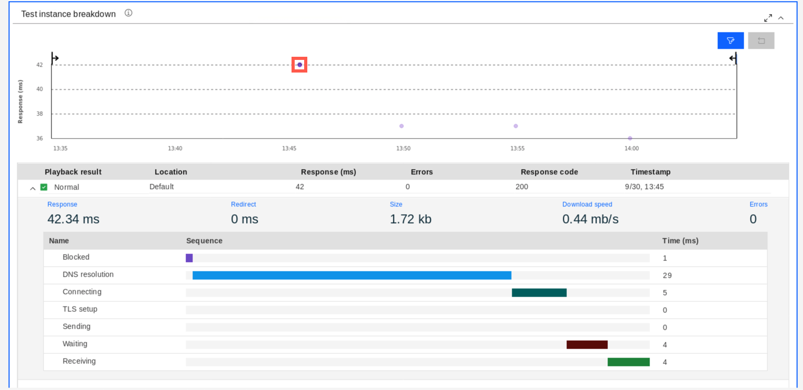

## （オプション）シンセティック・モニタリングの追加構成

1. デフォルトで構成されるエージェントの他に、より顧客に近い環境にエージェントを配置し、そこからリクエストを送って検証を行うことも可能です。  みていきましょう。

1. 緑の **Management Hub**のタブを開いて、以下のコマンドを実行して、シンセティック・モニタリング用のエージェントのバイナリーを構成していきましょう。
   ```sh
   cd
   tar xvf app_mgmt_syntheticpop_xlinux.tar.gz
   cd app_mgmt_syntheticpop_xlinux
   ```
1. シンセティック・モニタリング・エージェントを利用するためには、保管されたテスト・ターゲットの情報などをCloud Pak for MCMの管理ハブから取得する必要があり、この管理ハブの情報をConfigPakを利用して、エージェントに渡します。  Cloud Pak for MCM のコンソールに戻り、 **Administer > Monitoring** を開きます。

   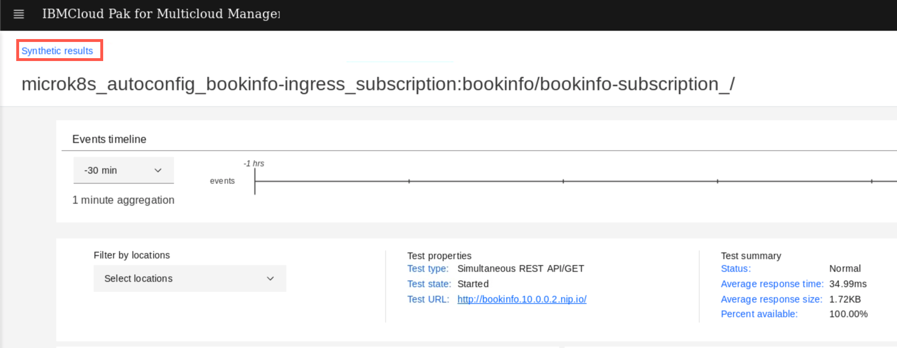

   

7. **Integration**のブロックをクリックし、**New integration**ボタンを開きます。

   

   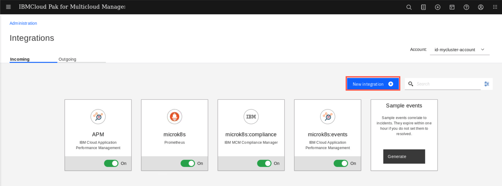

8. **Configure**の下にある **Monitoring Data Collectors** ボタンをクリックします。

   

9. Do not provide any name, just click the **Download file** button and save the file to your workstation

   

   

10. Go back to the green terminal titled **Management Hub** and run the following commands to preconfigure and install the Synthetic Monitoring agent

    ```sh
    ./config-pop.sh -f /home/ibmuser/Downloads/ibm-cloud-apm-dc-configpack.tar
    ```

    Answer the installation wizard with the following values:

    ```sh
    You will configure a new local point of presence (PoP).

    Enter a name for your PoP. Your PoP will be identified by this name: pop_user1 -- A point of presence name
    The PoP name is set to pop_user1

    Enter the name of the country in which your PoP is located: USA -- Use any country
    The country name is set to USA

    Enter the name of the city in which your PoP is located: Las Vegas -- Use any city
    The city name is set to Las Vega

    Enter a description of your PoP (optional): pop_user1 -- It is just descritpion
    The description is set to "pop_user1"

    Enter the proxy server address for communicating with IBM ICAM server. The address format is ip:port (Press Enter if you do not need to use a proxy) :  Press Enter
    Proxy server address for communicating with IBM ICAM server is set to

    Update the proxy type (no | manual | pac) for playbacking synthetic tests to monitor your web applications. Enter 'no' to choose no proxy. Enter 'manual' to configure your proxy with a proxy server ip address and port number. Enter 'pac' to use an automatic configuration URL. (Press Enter if you do not want to make any changes: no): Press Enter

    Playback proxy type is set to no

    Your PoP is configured with the following details:
    LOCATION="pop_user1,USA,Las Vegas,0,0,pop_user1"
    AGENT_PROXY_SERVER=""
    PLAYBACK_PROXY_TYPE="no"
    PLAYBACK_PROXY_HOST_PORT=""
    PLAYBACK_PROXY_BYPASS=""
    PLAYBACK_PROXY_CONFIG_URL=""
    CACHE_REDIS_MAX_SIZE_MB=""

    Do you confirm? [y for yes or n for no]: Press 'y'
    pop.properties is configured! You can run start-pop.sh to start your PoP.
    ```

    Finally, run the following command to start the agent:

    ```sh
    ./start-pop.sh
    ```

11. Now, when you have additional Point-of-Presence (syntectic monitoring agent) installed, go back to your browser and navigate to the **Administration** page, and then select the **Synthetics** tile.

    

    Click **Create** button

    

    Give your test a name and description.

    

    Scroll down and select the test type (Webpage). You can notice there are other types of tests available - you can for example replay web session recorded with Selenium, or create API tests using either SOAP or REST APIs.

    

    In the next step you need to provide the URL of the bookinfo main application page. Scroll down and provide the following values:

    URL: http://bookinfo.10.0.0.2.nip.io:9080/productpage?u=normal

    **IMPORTANT** Use the above URL, don't worry that the screenshots below shows differnt one!

    Threshold value for Warning: 1

    Threshold value for Critical: 2

    

    Click **Verify test**

    

    

    On the next page, change the test frequency to 1 minute and make sure that your previously installed PoP agent is selected

    

    Click **Finish** at the bottom of the page

    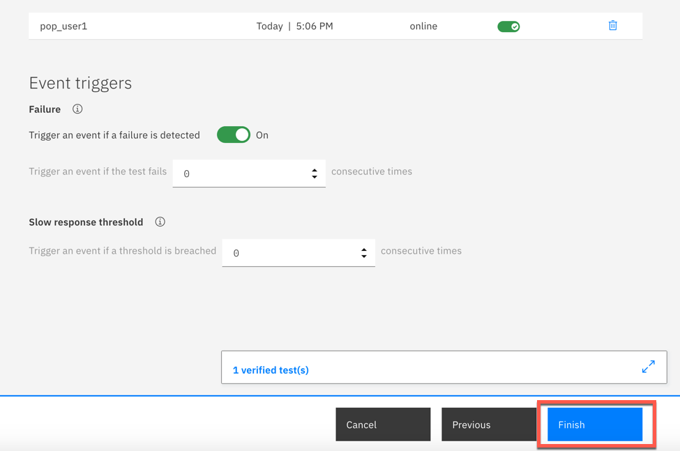

    Now, you have synthetics agent that will generate the traffic against the Bookinfo application. You can move to the final part of the tutorial, exploring tools available for Site Reliability Engineers.

***

## Explore SRE Golden Signals

   During this lab exercise, you will be exploring the Golden Signals.  The Golden Signals are a way of normalizing the performance KPIs to make it easier and more intuitive for an SRE to debug a problem.

1. In the browser with the Cloud Pak user interface, click the Resources tab

   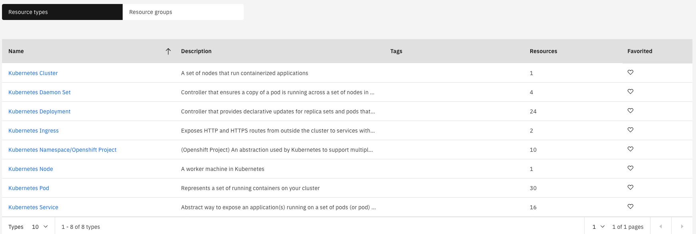

2. Select "Kubernetes Services"

   You will see a list of kubernetes services that are running in your environment

   

3. Click the link for the "productpage" resource

   You will navigate to the page for the productpage microservice.  Let's explore this page as seen below

   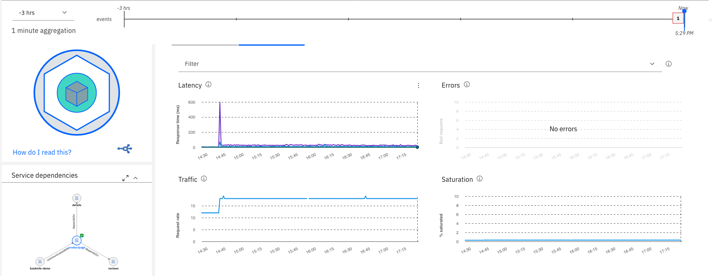

4. Deployment topology

   In the upper left corner, you see the "Deployment topology".  You've seen this before in the context of the kubernetes cluster.  Now, you're viewing it in the context of the productpage microservice.  What the topology is showing you is that this microservice is deployed to one pod on one node in the cluster.  If you scaled out the deployment to 2 pods, then you would see 2 pods in the Deployment topology.

5. Golden Signals

   Next, look at the golden signals on the right side of the page.   The 4 graphs labeled Latency, Errors, Traffic, and Saturation are the Golden Signals.  These are the most important metrics for Site Reliability Engineering (SRE) as they show the metrics imoprtant from the end-user perspective, that have been normalized for different application/middleware domains.  Let's explore Latency a little more.

6. Latency

   Flyover the Latency Graph.  You'll see a graph showing the latency shown in different percentiles (50th, 90th, and 95th).  By using percentiles, you get a much better idea how the applicaiton is performing.

   

   Next, select the dropdown list in the Filter.  The default behavior is to show 50th, 90th, and 95th percentile for all URLs.  But, sometimes you want to filter the data.

   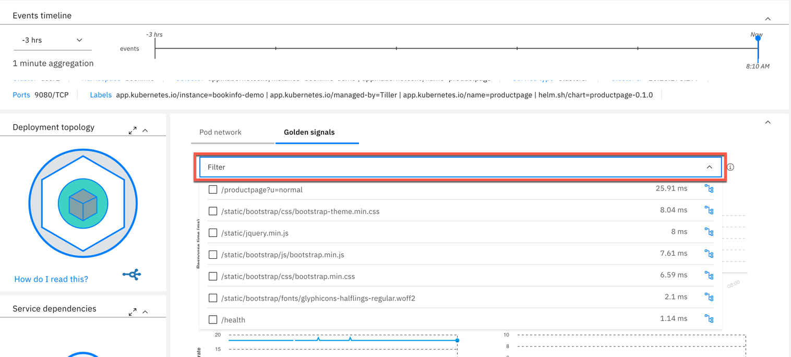

   Select 1 or more of the URLs for the productpage microservice

   View the latency data for the URLs that you selected.

   Within filters, select the icon on the far right for the "/productpage?u=normal" URL.

   

   After you click the icon, you will see some very useful information as seen below.  At the top of the page, you see a scatter plot chart that allows you to see a distribution of the requests.  This is a very useful way to visualize the transactions because it allows you to see patterns and outliers.

   Below that, expand one of the requests and you will see a breakdown of where the request spent its time.

   

   Close the Trace Breakdown window by clicking the "X" in the upper right corner.

   

   Now, click the 3 vertical dots in the upper right corner of the Latency graph and select "Latency Options"

   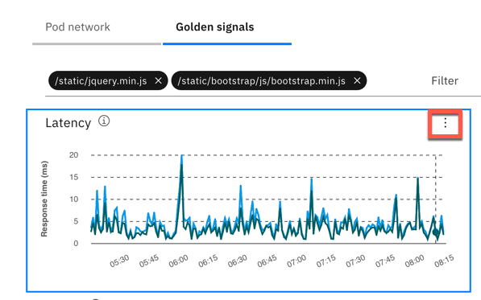

   Notice that you can customize the latency options.  Either change the latency percentiles or add/delete lines from the graph.  Try it out.

   

7. Next, examine the Service dependencies

   

   The service dependency shows a 1-hop topology of the microservices.  For the productpage service, it shows that there are clients connecting to the service and there is a dependency on "details" and "reviews".

   Click on "reviews" icon.  You will navigate to that microservice and see the 1-hop topology for the "review" service.  Examine the golden signals for the "reviews" service.

8. Full Service Topology

   Most of the time, the 1-hop topology is good enough to diagnose the root cause of a problem.  But, sometimes you need to see additional information.  Click the **"expand to the full screen"** icon in the upper right corner of the service dependencies to expand the view.

   

   The view you see comes from an embedded capability called Agile Service Manager (ASM).  ASM allows you to expand to more than hop in the topology. It also allows you to visualize changes that are occurring in the application.  Since change introduces most of the problems in IT, this is a powerful capability.

   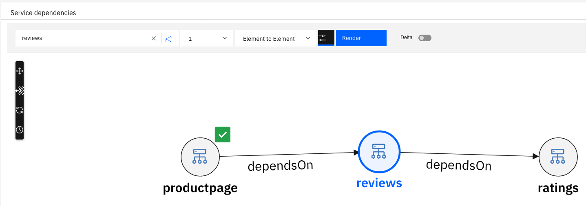

   Let's start by switching to a 2-hop topology.  Select the dropdown in the top-middle of the screen and change the value to "2".  Then click "Render"

   

   We won't examine it here, but ASM allows you to hide/show some additional objects in the topology.  In this topology, you see the microservice topology.  If you want, you can add the pods into the topology.  To add/hide elements on the page, click the **Filter** icon to the left of the "Render" button.

   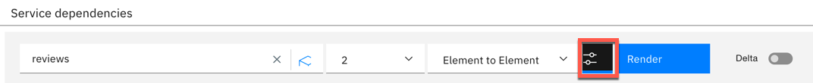

   ASM has powerful capabilities to show you what's changing.  This includes topology changes, state changes, and property changes.  We won't be exploring that capability since there haven't been any changes to the application.  Feel free to explore additional ASM capabilities.  When you are done exploring, you can click on one of the icons for the microservices and you will navigate back to the Golden Signal view.

9. Drill Down into the Runtime

   Sometimes you need additional details that can only be gathered from the data collector that is running within the runtime.  If the app server (python, Node.js, JVM, golang) is instrumented with a lightweight data collector, you can click on the container and drilldown into the runtime metrics.

   Click on the "container" in the Deployment topology.

   

   You are now viewing the detailed container metrics for this microservice. To navigate to the detailed metrics reported by the data collector, scroll down and click the appropriate name in **Related resources** window.

   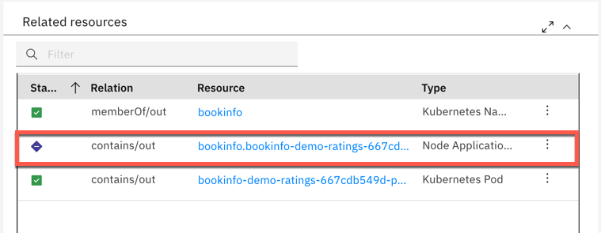

   The runtime page shows selection of most important metrics for a selected runtime type

   

   To expore any other metric, scroll down the page and expand the **Custom metrics** section, picking the metric you want and additional filtering and display options.

   

   This concludes the exercise. You now understand how to naviagate Golden Signals view.

   Additional resources:
   - [Golden Signals video on YouTube](https://youtu.be/z5WLD6vANvw)
   - [Blog: Golden Signals explained](https://www.ibm.com/cloud/blog/video-better-application-monitoring-with-sre-golden-signals)

***

## Summary

You completed the Cloud Pak for Multicloud Management tutorial: Monitoring and using SRE Golden Signals. Throughout the tutorial, you explored the key takeaways:
-	`Understand Cloud Pak for Multicloud Management Monitoring module`
-	`Learn how to add cloud native monitoring to the managed cluster`
- `learn how to gather monitoring metrics from the managed cluster`
-	`Learn how to use SRE Golden Signals to monitor application running on the managed cluster`

If you would like to learn more about Cloud Pak for Multicloud Management, please refer to:
-	<a href="https://www.ibm.com/cloud/cloud-pak-for-management" target="blank">Cloud Pak for Multicloud Management home page</a>
- <a href="https://www.ibm.com/demos/collection/Cloud-Pak-for-Multicloud-Management" target="blank">Cloud Pak for Multicloud Management Demos </a>
