# Chapter4 インフラストラクチャ・モニタリング

## モニタリング・モジュールの構成
Cloud Pak for Multicloud Managementにおいて、モニタリング・モジュールが構成されている場合、統合した管理対象クラスターに対して、自動的に Kubernetesデータ・コレクター（＊＊cloud native monitoring＊＊とも呼びます)をデプロイすることが可能です。  
このデータ・コレクターは、管理ハブ・クラスターに すべてのノードやPodなど、Kubernetesリソースに関する情報を収集し送ることができます。

### Kuberntesデータ・コレクターの構成
まず Kubernetes データ・コレクターをデプロイします。これまでのアプリケーションのデプロイメントと同様、クラスターにラベルを付与することで、Kubentes データ・コレクターが自動的に配置されます。  
1. Cloud Pak for Multicloud Management のコンソールを開き、メニューから Automate Infrastructure > Clusters を開きます。 
クラスターに対する定義内容は、Red Hat Advanced Cluster Managementコンポーネントを見ていますので、Red Hat Advanced Cluster Management コンポーネントのコンソールから実施して頂いても問題ありません。 

1. microk8s クラスターの右端のメニューより **Edit labels**を開きます。

1. ラベル設定画面が開きますので、ラベル名**ibm.com/cloud-native-monitoring**、値=＊＊enabled**　を指定し、**Add +**をクリックします。

1. 以下のように リストに　**ibm.com/cloud-native-monitoring=enabled**が加えられてことを確認して、**Save**をクリックします。

１．

1. アクセスコントロールの管理画面が開きます。  
**Authentication**タブには、認証統合のための LDAPが定義されています。
LDAPなどからインポートしたユーザーやグループを、Cloud Pak for Multicloud Management での役割に応じて編集する定義が **Teams** です。  **Teams**タブを開きます。

1. Teamsで定義されている運用チーム **operations**チームをクリックします。  
このoperationsチームには、LDAP上で*operations*グループに分類されているメンバーと、ユーザー *bob* が関連付けらています。

1. Resourecesタブを開きます。**operations**チームのメンバーがアクセス可能なリソースが定義されています。  ここに microk8s クラスターが含まれていないため、アクセス権限を追加します。

1. 右上の **Manage Resource**をクリックし、microk8s にチェックを入れて Saveします。  

実際の動作イメージを説明すると、管理ハブ・クラスターの microk8s ネームスペース上に、管理対象クラスター上で稼働するデータコレクターから集められたデータが保管されます。  
このため、この管理ハブ・クラスター上の micork8s ネームスペースへのアクセス許可を与えることで、**operations**チームのメンバーは microk8sクラスターへのデータを見ることができるようになっています。


To deploy Kuberenetes data collector (also known as cloud native monitoring) complete the steps below.

1. First, you need to label target cluster with **ibm.com/cloud-native-monitoring=enabled**. You can do this in web console, or run the following command in a green terminal titled **Management Hub**

   ```sh
   cloudctl mc label cluster microk8s ibm.com/cloud-native-monitoring=enabled -n microk8s
   ```

   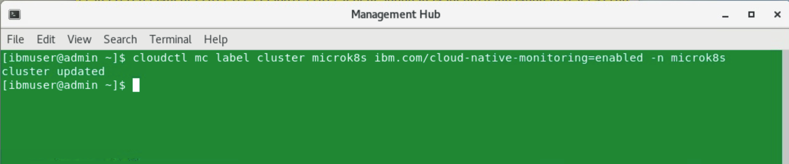

2. Second, you need to add the target cluster namespace as a managed resource to your team. Again, you can do this in web console (Menu -> Administer -> Identity and access -> Teams tab, select the team 'operations', edit the Resources), or run the following command in a green terminal titled **Management Hub**

   ```sh
   cloudctl iam resource-add operations -r crn:v1:icp:private:k8:mycluster:n/microk8s:::
   ```

   This command adds a namespace **microk8s** (this namespace was automatically created during cluster import and contains the cluster CRD) as a managed resource to the team **operations**. This operations triggers the deployment process of cloud-native-monitoring operator to the target cluster.

   You can check that the operator was deployed running the following commands in a yellow terminal connected to **MicroK8s** cluster

   ```sh
   kubectl get pods -n cp4mcm-cloud-native-monitoring
   ```

   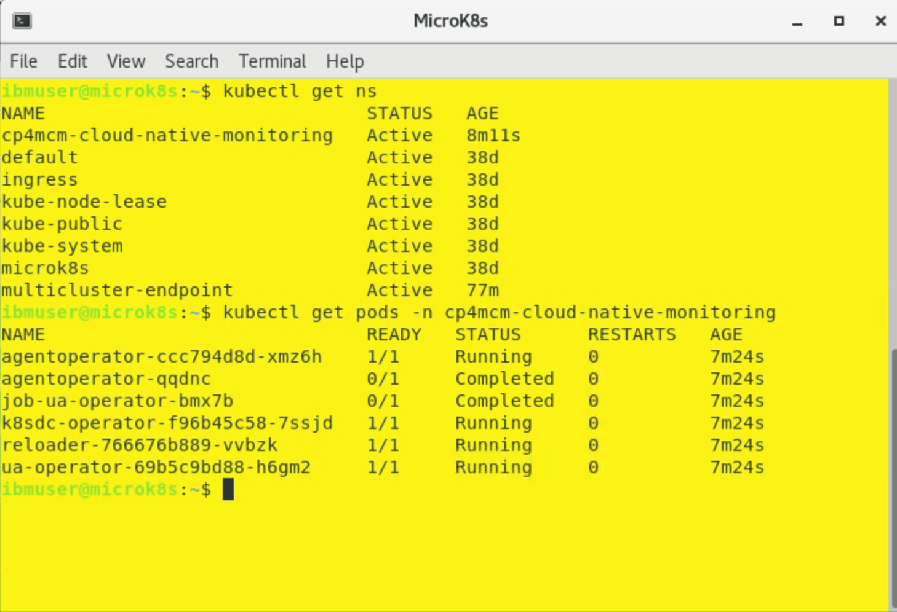

3. Finally, you need to open the Monitoring module console as a user belonging to the operations team - user **bob** in our case. Select "hamburger" menu in the top-left corner and then **Monitor health** (2) and **Infrastructure monitoring**.

   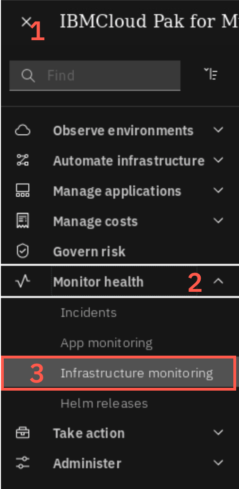

   If you are redirected to login page, login again as user **bob** with password **Passw0rd**. Eventually, you should see the **Resources** tab shown below:

   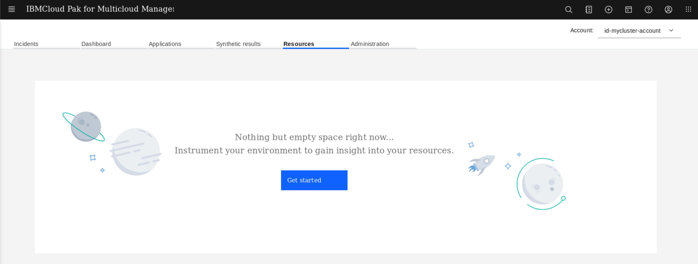

   The page probably won't show any resources yet, because the process to install Kubernetes data collector was just started. You can check if it was successfully deployed running the previous command again (in yellow terminal).

   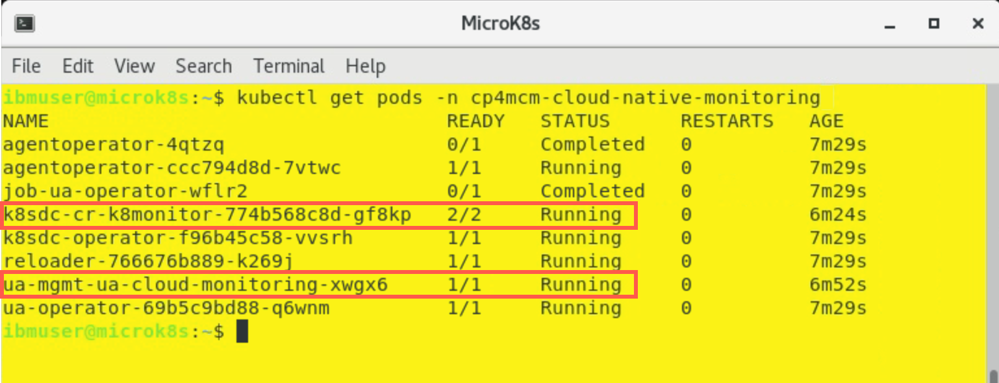

   When it is deployed, after 1-2 minutes you can refresh the browser, and you should see the view showing now all the resources from the managed cluster.

   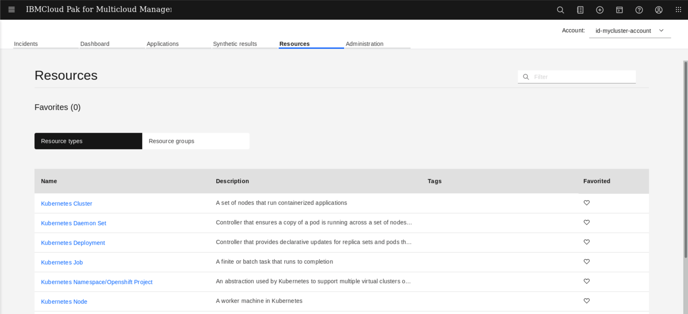

   Click the **Kubernetes cluster**.

   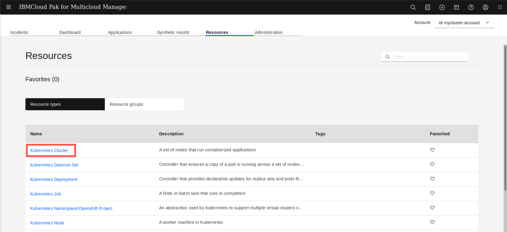

   Then click **microk8s**.

   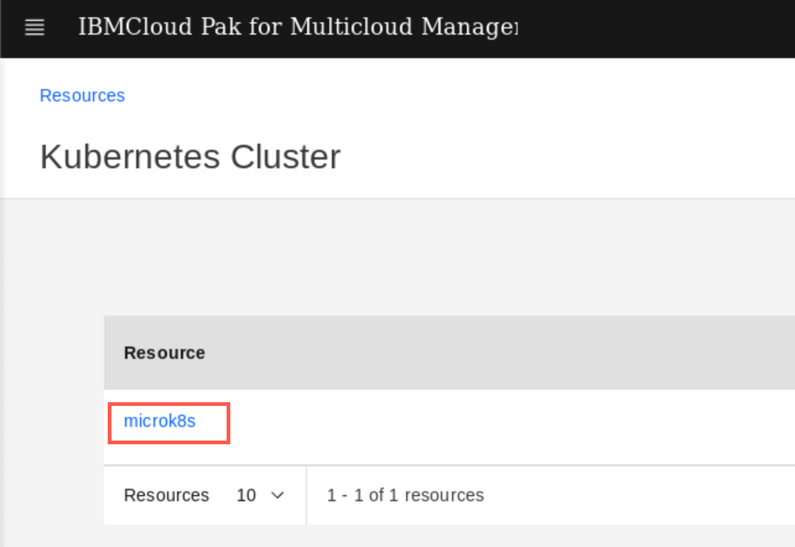

   The next view, let you explore the metrics and events releated to the selected resource. On top, you can see the Event timeline (1) for wihich you can change the time window (from 30 minutes to 1 week). Deployment topology widget (2) shows how the specific resource is located within the cluster.

   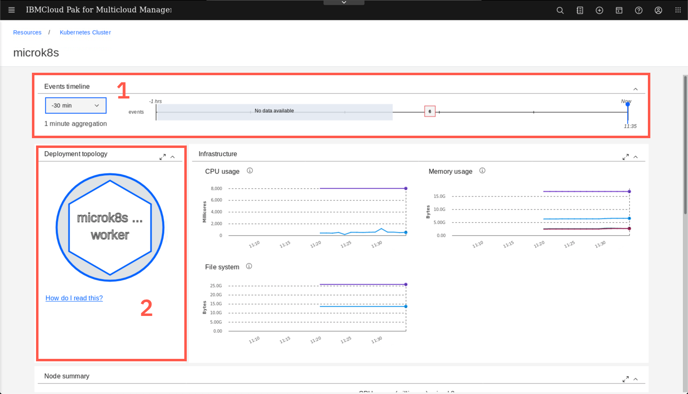

   If you hover over the numbers on the Timeline (1) you can see the details of the events. You can also click the 'How do I read this' link (2) on the Deployment topology to learn hot to use that widget.

   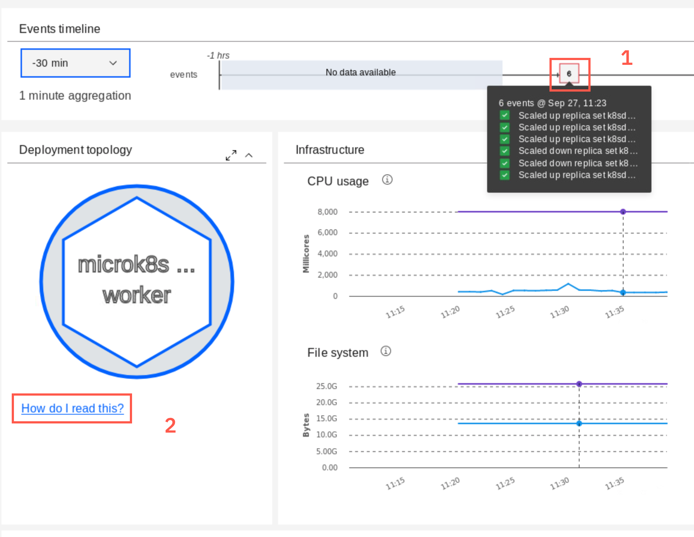

   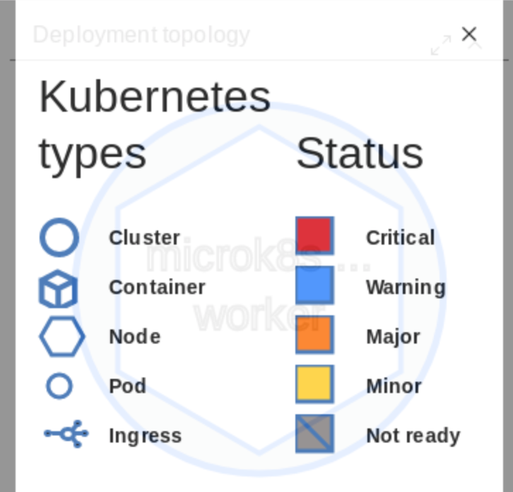

   Feel free to explore other resources and their metrics. For example you can click the worker node icon on the Deployment topology widget.

   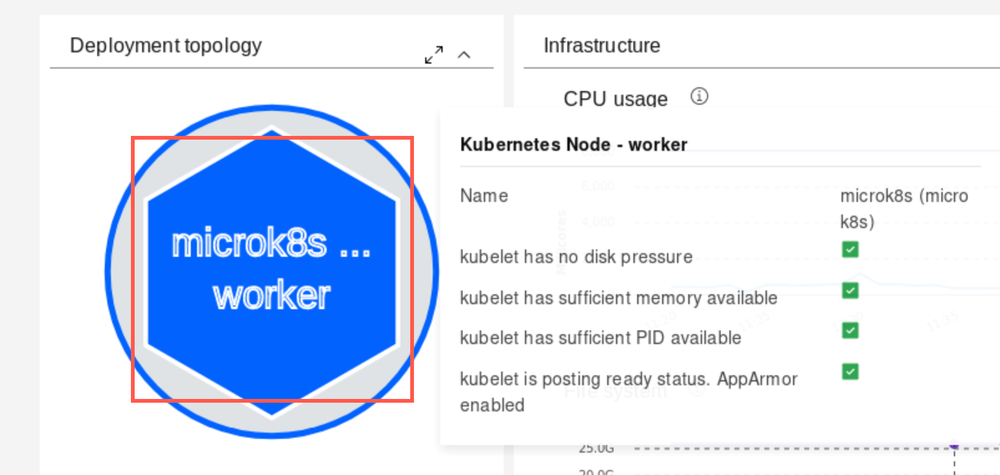

***

## Deploy Bookinfo Application

On top of monitoring Linux worker nodes and basic Kubernetes objects Operations teams want are responsible for monitoring business applications. So let's deploy sample application, called Bookinfo

1. To start, clone the git repository containing the yaml files needed to deploy the application. Using the green terminal window, run the following commands on the **Management Hub**

   ```sh
   git clone https://github.com/dymaczew/charts
   cd charts
   ```

2. Apply the application resources running the following commands:

   ```sh
   /home/ibmuser/oclogin.sh
   oc apply -f bookinfo-multiclister-2020.2.1
   oc apply -f kubernetes-1.18-ingress-deployable.yaml
   ```

   If you happen to run Kubernetes 1.19 on the your managed cluster (outside the Skytap environment) use kubernetes-1.19-ingress-deployable.yaml. Ingress API was changed in 1.19 and extended with new mandatory fields

   The output looks like the following:

   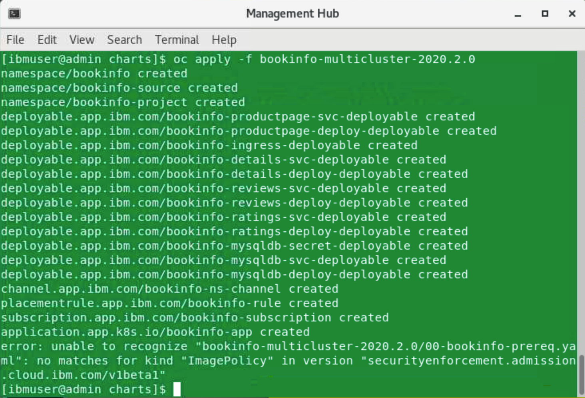

   Don't worry about the error in the last line - it just means that ImagePolicy admission controller is not used in the environment.

3. Now, let's edit the placement rule for the application to get it deployed on the managed cluster (we tagged in with label "environment=QA"). Navigate to application view, selecting the "hamburger" menu in the top-left corner, then **Observe environments** and **Overview**

   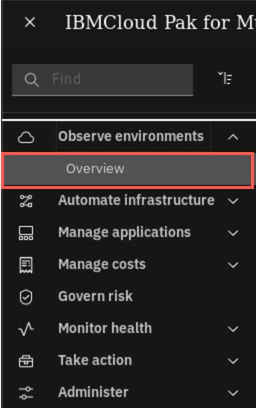

   On the overview page, scroll down to the Applications section and select **bookinfo-app** link. We recommend this way, becasue for some reason (probably a bug?) the application is not listed directly on the Hybrid Applications list

   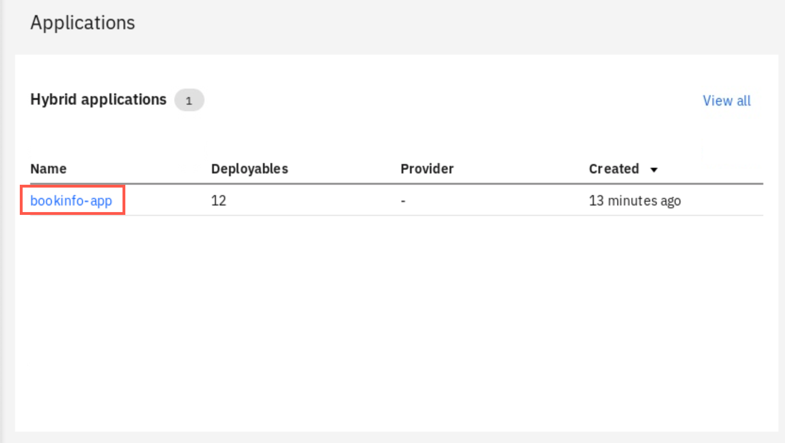

4. When the Application view opens, click on the **bookinfo-rule** icon

   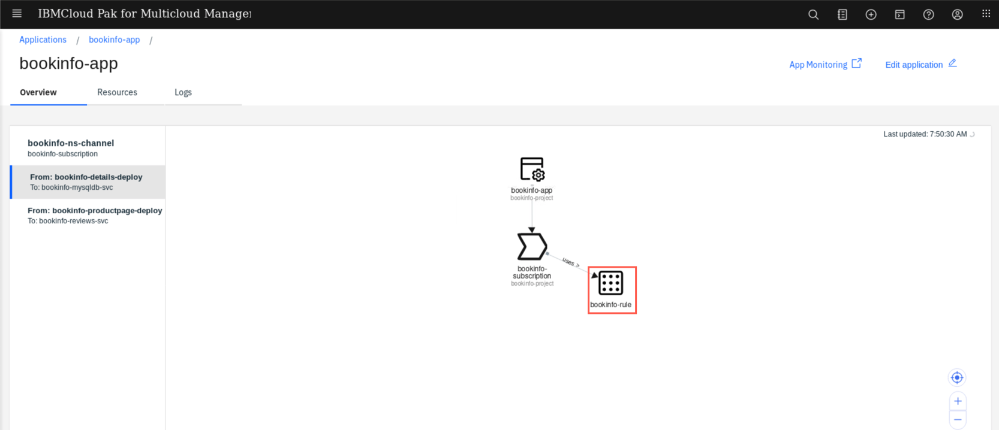

5. Edit the placement rule in the editor on the right, changing the value of the label from **Dev** to **QA** (1) and then apply you changes with the button on top of the editor(2)

   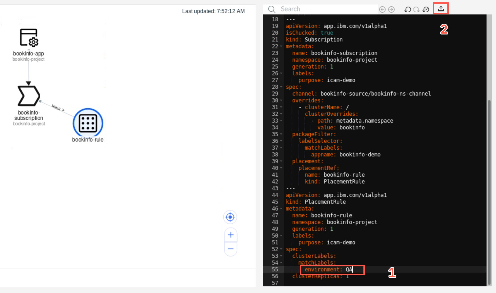

6. After a few seconds, you should notice that the application is now being placed on the **microk8s** cluster. The deployment takes usually 1-2 minutes needed to pull images and start containers.

   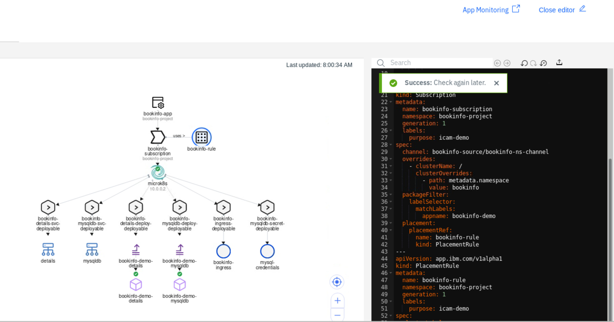

7. You can verify if the application was successfuly deployed and is accessible by opening a new browser tab and entering the URL: `bookinfo.10.0.0.2.nip.io`. You should reach the page that looks like below:

   

***

## Exploring synthetics monitoring

Cloud Pak for Multicloud Management is capable of monitoring the application availability using a synthetic transaction monitoring. There is a default agent installed on the Hub cluster that automatically starts monitoring any ingress object that is deployed as a part of Hybrid application. Let's check how it looks like.

1. Open the Monitoring module interface (Select "hamburger" menu, then **Monitor Health**, then **Infrastructure monitoring**). Then select the **Synthetic results** tab

   

2. On the page Synthetic results page, you should see the automatically configured monitor for ingress deployed as a part of Bookinfo application. Click on the monitor name to explore details

   

3. You can adjust the scope of the timeline, reducing the windows to last 30 minutes (1). You can also select to see a Response time graph or a response time Breakdown (2). This helps to diagnose issues related to name resolution on establishing the SSL session.

   

4. When you scroll down you can see the results of actual tests. Select any dot on the graph to see detailed breakdown of the response.

   

   You can deploy more agents in different locations to have your applications tested for availability and response time from a customer perspective. Deploying own agents allows also to configure more sophisticated test schedules. Let's see how it works.

5. Go to the green terminal titled **Management hub** and run the following commands to unpack the synthetics agent binaries that were downloaded for you.

   ```sh
   cd
   tar xvf app_mgmt_syntheticpop_xlinux.tar.gz
   cd app_mgmt_syntheticpop_xlinux
   ```
6. To configure the synthetic monitoring agent you need a config pack that will instruct agent where to look for test definitions and where to send the gathered data. Go back to you browser, click the **Synthetic results** breadcrumb in the top-left corner of the screen. Then select the Administration tab.

   

   

7. On the Administration view select the **Integrations** tile, then **New integration** button.

   

   

8. Click **Configure** under the **Monitoring Data Collectors** tile

   

9. Do not provide any name, just click the **Download file** button and save the file to your workstation

   

   

10. Go back to the green terminal titled **Management Hub** and run the following commands to preconfigure and install the Synthetic Monitoring agent

    ```sh
    ./config-pop.sh -f /home/ibmuser/Downloads/ibm-cloud-apm-dc-configpack.tar
    ```

    Answer the installation wizard with the following values:

    ```sh
    You will configure a new local point of presence (PoP).

    Enter a name for your PoP. Your PoP will be identified by this name: pop_user1 -- A point of presence name
    The PoP name is set to pop_user1

    Enter the name of the country in which your PoP is located: USA -- Use any country
    The country name is set to USA

    Enter the name of the city in which your PoP is located: Las Vegas -- Use any city
    The city name is set to Las Vega

    Enter a description of your PoP (optional): pop_user1 -- It is just descritpion
    The description is set to "pop_user1"

    Enter the proxy server address for communicating with IBM ICAM server. The address format is ip:port (Press Enter if you do not need to use a proxy) :  Press Enter
    Proxy server address for communicating with IBM ICAM server is set to

    Update the proxy type (no | manual | pac) for playbacking synthetic tests to monitor your web applications. Enter 'no' to choose no proxy. Enter 'manual' to configure your proxy with a proxy server ip address and port number. Enter 'pac' to use an automatic configuration URL. (Press Enter if you do not want to make any changes: no): Press Enter

    Playback proxy type is set to no

    Your PoP is configured with the following details:
    LOCATION="pop_user1,USA,Las Vegas,0,0,pop_user1"
    AGENT_PROXY_SERVER=""
    PLAYBACK_PROXY_TYPE="no"
    PLAYBACK_PROXY_HOST_PORT=""
    PLAYBACK_PROXY_BYPASS=""
    PLAYBACK_PROXY_CONFIG_URL=""
    CACHE_REDIS_MAX_SIZE_MB=""

    Do you confirm? [y for yes or n for no]: Press 'y'
    pop.properties is configured! You can run start-pop.sh to start your PoP.
    ```

    Finally, run the following command to start the agent:

    ```sh
    ./start-pop.sh
    ```

11. Now, when you have additional Point-of-Presence (syntectic monitoring agent) installed, go back to your browser and navigate to the **Administration** page, and then select the **Synthetics** tile.

    

    Click **Create** button

    

    Give your test a name and description.

    

    Scroll down and select the test type (Webpage). You can notice there are other types of tests available - you can for example replay web session recorded with Selenium, or create API tests using either SOAP or REST APIs.

    

    In the next step you need to provide the URL of the bookinfo main application page. Scroll down and provide the following values:

    URL: http://bookinfo.10.0.0.2.nip.io:9080/productpage?u=normal

    **IMPORTANT** Use the above URL, don't worry that the screenshots below shows differnt one!

    Threshold value for Warning: 1

    Threshold value for Critical: 2

    

    Click **Verify test**

    

    

    On the next page, change the test frequency to 1 minute and make sure that your previously installed PoP agent is selected

    

    Click **Finish** at the bottom of the page

    

    Now, you have synthetics agent that will generate the traffic against the Bookinfo application. You can move to the final part of the tutorial, exploring tools available for Site Reliability Engineers.

***

## Explore SRE Golden Signals

   During this lab exercise, you will be exploring the Golden Signals.  The Golden Signals are a way of normalizing the performance KPIs to make it easier and more intuitive for an SRE to debug a problem.

1. In the browser with the Cloud Pak user interface, click the Resources tab

   

2. Select "Kubernetes Services"

   You will see a list of kubernetes services that are running in your environment

   

3. Click the link for the "productpage" resource

   You will navigate to the page for the productpage microservice.  Let's explore this page as seen below

   

4. Deployment topology

   In the upper left corner, you see the "Deployment topology".  You've seen this before in the context of the kubernetes cluster.  Now, you're viewing it in the context of the productpage microservice.  What the topology is showing you is that this microservice is deployed to one pod on one node in the cluster.  If you scaled out the deployment to 2 pods, then you would see 2 pods in the Deployment topology.

5. Golden Signals

   Next, look at the golden signals on the right side of the page.   The 4 graphs labeled Latency, Errors, Traffic, and Saturation are the Golden Signals.  These are the most important metrics for Site Reliability Engineering (SRE) as they show the metrics imoprtant from the end-user perspective, that have been normalized for different application/middleware domains.  Let's explore Latency a little more.

6. Latency

   Flyover the Latency Graph.  You'll see a graph showing the latency shown in different percentiles (50th, 90th, and 95th).  By using percentiles, you get a much better idea how the applicaiton is performing.

   

   Next, select the dropdown list in the Filter.  The default behavior is to show 50th, 90th, and 95th percentile for all URLs.  But, sometimes you want to filter the data.

   

   Select 1 or more of the URLs for the productpage microservice

   View the latency data for the URLs that you selected.

   Within filters, select the icon on the far right for the "/productpage?u=normal" URL.

   

   After you click the icon, you will see some very useful information as seen below.  At the top of the page, you see a scatter plot chart that allows you to see a distribution of the requests.  This is a very useful way to visualize the transactions because it allows you to see patterns and outliers.

   Below that, expand one of the requests and you will see a breakdown of where the request spent its time.

   

   Close the Trace Breakdown window by clicking the "X" in the upper right corner.

   

   Now, click the 3 vertical dots in the upper right corner of the Latency graph and select "Latency Options"

   

   Notice that you can customize the latency options.  Either change the latency percentiles or add/delete lines from the graph.  Try it out.

   

7. Next, examine the Service dependencies

   

   The service dependency shows a 1-hop topology of the microservices.  For the productpage service, it shows that there are clients connecting to the service and there is a dependency on "details" and "reviews".

   Click on "reviews" icon.  You will navigate to that microservice and see the 1-hop topology for the "review" service.  Examine the golden signals for the "reviews" service.

8. Full Service Topology

   Most of the time, the 1-hop topology is good enough to diagnose the root cause of a problem.  But, sometimes you need to see additional information.  Click the **"expand to the full screen"** icon in the upper right corner of the service dependencies to expand the view.

   

   The view you see comes from an embedded capability called Agile Service Manager (ASM).  ASM allows you to expand to more than hop in the topology. It also allows you to visualize changes that are occurring in the application.  Since change introduces most of the problems in IT, this is a powerful capability.

   

   Let's start by switching to a 2-hop topology.  Select the dropdown in the top-middle of the screen and change the value to "2".  Then click "Render"

   

   We won't examine it here, but ASM allows you to hide/show some additional objects in the topology.  In this topology, you see the microservice topology.  If you want, you can add the pods into the topology.  To add/hide elements on the page, click the **Filter** icon to the left of the "Render" button.

   

   ASM has powerful capabilities to show you what's changing.  This includes topology changes, state changes, and property changes.  We won't be exploring that capability since there haven't been any changes to the application.  Feel free to explore additional ASM capabilities.  When you are done exploring, you can click on one of the icons for the microservices and you will navigate back to the Golden Signal view.

9. Drill Down into the Runtime

   Sometimes you need additional details that can only be gathered from the data collector that is running within the runtime.  If the app server (python, Node.js, JVM, golang) is instrumented with a lightweight data collector, you can click on the container and drilldown into the runtime metrics.

   Click on the "container" in the Deployment topology.

   

   You are now viewing the detailed container metrics for this microservice. To navigate to the detailed metrics reported by the data collector, scroll down and click the appropriate name in **Related resources** window.

   

   The runtime page shows selection of most important metrics for a selected runtime type

   

   To expore any other metric, scroll down the page and expand the **Custom metrics** section, picking the metric you want and additional filtering and display options.

   

   This concludes the exercise. You now understand how to naviagate Golden Signals view.

   Additional resources:
   - [Golden Signals video on YouTube](https://youtu.be/z5WLD6vANvw)
   - [Blog: Golden Signals explained](https://www.ibm.com/cloud/blog/video-better-application-monitoring-with-sre-golden-signals)

***

## Summary

You completed the Cloud Pak for Multicloud Management tutorial: Monitoring and using SRE Golden Signals. Throughout the tutorial, you explored the key takeaways:
-	`Understand Cloud Pak for Multicloud Management Monitoring module`
-	`Learn how to add cloud native monitoring to the managed cluster`
- `learn how to gather monitoring metrics from the managed cluster`
-	`Learn how to use SRE Golden Signals to monitor application running on the managed cluster`

If you would like to learn more about Cloud Pak for Multicloud Management, please refer to:
-	<a href="https://www.ibm.com/cloud/cloud-pak-for-management" target="blank">Cloud Pak for Multicloud Management home page</a>
- <a href="https://www.ibm.com/demos/collection/Cloud-Pak-for-Multicloud-Management" target="blank">Cloud Pak for Multicloud Management Demos </a>
